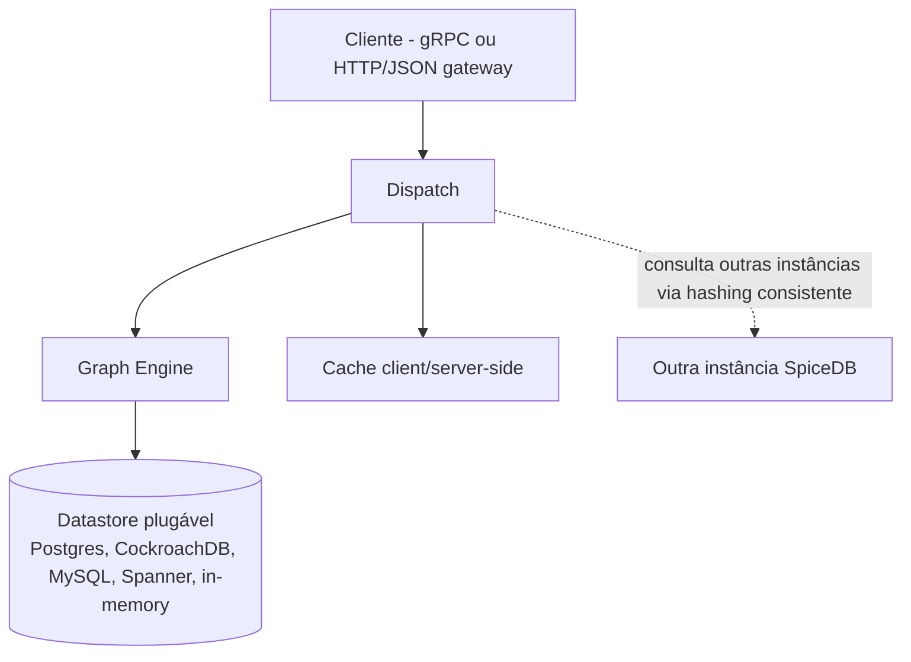

# O que é o SpiceDB (explicado do jeito mais simples possível)

> Artigo 1 de 5. Aqui você entende de onde o SpiceDB veio, o que é
> ReBAC, o que é ABAC, e como a Netflix usa isso. Os próximos artigos
> mostram como tudo isso aparece no código desta POC (2), o que cada
> arquivo de configuração faz (3), como os dados ficam guardados no
> Postgres (4), e quais outras ferramentas fazem esse mesmo tipo de
> trabalho (5). Tem também uma collection do Postman
> (`spicedb-poc.postman_collection.json`) pra testar tudo na prática.

## O problema, em uma frase

Imagine um porteiro de prédio. Toda vez que alguém chega, ele precisa
responder: "essa pessoa pode entrar?". Parece simples, mas não é: "mora
aqui?", "é visita de quem mora?", "é entregador com encomenda de
verdade?", "é o síndico?". Um sistema de software com muitos usuários e
muitos recursos (arquivos, vídeos, contas) tem exatamente esse
problema, só que multiplicado por milhões.

O jeito mais comum de resolver isso é espalhar a resposta pelo código:
um pedaço aqui checa uma coisa, outro pedaço ali checa outra. Funciona
até crescer demais — aí fica caro de conferir e fácil de errar.

Este artigo conta duas formas diferentes de resolver esse problema —
**ReBAC** e **ABAC** — e mostra como a Netflix usa as duas ao mesmo
tempo, cada uma para um propósito diferente.

---

## De onde isso veio: o paper Zanzibar, do Google

Em 2019, o Google contou publicamente como resolveu esse problema para
o Drive, o Calendar, o Maps, o Photos e o YouTube — todos precisando
responder "quem pode ver o quê" em milissegundos, bilhões de vezes por
dia:

> **"Zanzibar: Google's Consistent, Global Authorization System"**
> Ruoming Pang, Ramon Caceres, Mike Burrows, Zhifeng Chen, Pratik Dave,
> Nathan Germer, Alexander Golynski, Kevin Graney, Nina Kang, Lea
> Kissner, Jeffrey L. Korn, Abhishek Parmar, Christina D. Richards,
> Mengzhi Wang — USENIX ATC '19.
> Paper: <https://research.google/pubs/zanzibar-googles-consistent-global-authorization-system/>
> Apresentação: <https://www.usenix.org/conference/atc19/presentation/pang>

A ideia central: em vez de cada aplicativo guardar sua própria regra de
acesso, existe **um serviço só**, guardando relações — "esta pasta é da
conta X", "este documento está dentro desta pasta" — e todo mundo
pergunta pra esse serviço em vez de decidir sozinho. O SpiceDB (o motor
que esta POC usa) é uma versão open-source dessa mesma ideia.

O paper trouxe três conceitos, que o SpiceDB usa com outros nomes
(ver <https://authzed.com/docs/spicedb/concepts/zanzibar>):

- **Relation tuple** → no SpiceDB, **Relationship**: um fato do tipo
  "A se relaciona com B".
- **Namespace** → no SpiceDB, **Object Type**: a definição de um tipo
  de coisa e quais relações ela pode ter.
- **Zookie** → no SpiceDB, **ZedToken**: evita que alguém enxergue um
  acesso que já devia ter sido cortado, só porque a informação nova
  ainda não chegou.

Números do paper: trilhões de relações guardadas, milhões de consultas
por segundo, resposta em menos de 10 milissegundos em 95% dos casos, e
mais de 99,999% de disponibilidade ao longo de 3 anos.

---

## ReBAC: "quem pode o quê" vira uma pergunta sobre relações

**ReBAC** (Relationship-Based Access Control) responde à pergunta de
acesso olhando pra **relações entre coisas**, não pra uma lista fixa de
papéis:

> "Under ReBAC, permissions are granted based on the relationships
> between the entities involved (…) e.g., a user might be granted
> access to a document if they have a relationship with the folder in
> which the document resides."
> — Permit.io, <https://www.permit.io/blog/what-is-rebac>

Compare com o jeito antigo (RBAC): cada pessoa tem um "papel" fixo,
tipo "Admin" ou "Editor". Isso cansa rápido — toda vez que aparece um
caso novo, nasce um papel novo ("Editor-da-Pasta-X"). O ReBAC evita
isso: a permissão depende da relação com aquele recurso específico, não
de um papel geral. O time do OpenFGA resume bem:

> "ReBAC is a superset of RBAC and natively covers ABAC scenarios when
> attributes are expressed as relationships."
> — <https://openfga.dev/docs/authorization-concepts>

Ou seja: dá pra "forçar" um cenário de ABAC dentro do ReBAC, transformando
cada atributo numa relação. Só que, como o caso da Netflix mostra
adiante, isso nem sempre é uma boa ideia.

---

## ABAC: a permissão é calculada na hora, olhando pra atributos

**ABAC** (Attribute-Based Access Control) tem até uma definição oficial
do governo americano:

> "ABAC is a logical access control methodology where authorization to
> perform a set of operations is determined by evaluating attributes
> associated with the subject, object, requested operations, and, in
> some cases, environment conditions against policy, rules, or
> relationships."
> — NIST Special Publication 800-162,
> <https://csrc.nist.gov/pubs/sp/800/162/upd2/final>

Em vez de perguntar "existe uma relação escrita entre A e B?", o ABAC
pergunta "quais são os atributos de A, de B, e do momento agora — e a
regra permite essa combinação?". Exemplo simples: "gerente de marketing
pode publicar post de marketing" é ABAC (depende do cargo e da
categoria do post). Já "Alice pode editar o Documento X porque é dona
da pasta que contém X" é ReBAC.

A diferença que mais importa: no ABAC, o dado usado na decisão só
existe **na hora da pergunta**. No ReBAC, o dado já estava escrito
antes.

---

## Dá pra usar os dois juntos? Sim — foi o que a Netflix pediu

O SpiceDB, que nasceu 100% ReBAC, ganhou uma funcionalidade chamada
**Caveats**, que mistura os dois modelos:

> "Caveats allow for an elegant way to model dynamic policies and
> ABAC-style (Attribute Based Access Control) decisions while still
> providing scalability and performance guarantees."
> — <https://authzed.com/docs/spicedb/concepts/caveats>

Uma "caveat" é uma condição (escrita numa linguagem chamada CEL) que
fica grudada numa relação, mas só é conferida na hora da pergunta, com
os dados daquele momento. Exemplo da própria documentação: uma relação
`viewer` que só vale se o IP de quem pergunta estiver numa lista
permitida.

Esta POC usa a mesma ideia, só que com região geográfica em vez de IP —
ver `02-como-o-spicedb-funciona-nesta-poc.md`, seção "Caveats na
prática".

Foi a **Netflix** quem pagou pra essa funcionalidade ser criada, e
contou o motivo num artigo público:

> **"ABAC on SpiceDB: Enabling Netflix's Complex Identity Types"**
> Chris Wolfe, Joey Schorr, Victor Roldán Betancort — Netflix
> TechBlog, 19 de maio de 2023.
> <https://netflixtechblog.com/abac-on-spicedb-enabling-netflixs-complex-identity-types-c118f374fa89>
> (republicado em <https://authzed.com/blog/abac-on-spicedb-enabling-netflix-complex-identity-types>;
> case study em <https://authzed.com/customers/netflix>)

O problema da Netflix não era sobre pessoas — era sobre **máquinas**:
"esta instância específica do serviço Data Processor, rodando na região
`eu-west-1`, em modo de teste". Modelar isso só com ReBAC exigiria
escrever uma relação nova pra cada combinação de região/ambiente/conta,
e ainda corria o risco de negar acesso por engano quando a relação
ainda não tinha sido escrita a tempo. A saída foi deixar essa parte ser
calculada na hora (ABAC), dentro do mesmo SpiceDB — daí o nome do
artigo, "ABAC on SpiceDB".

### E o sistema de assinantes da Netflix (PACS)? Não é evidência contra o SpiceDB

O caso descrito acima é sobre autorizar **máquinas**, não sobre "a Alice
pode assistir a este filme". Para autorizar **assinantes**, a Netflix
usa (ou usava, na época da talk) um sistema próprio, apresentado
publicamente como **PACS**:

> **"Authorization at Netflix Scale"** — Travis Nelson (Netflix, time
> AIM), QCon Plus 2022.
> <https://www.infoq.com/presentations/authorization-scalability/>

O PACS olha pra coisas como status da conta, plano, tipo de aparelho,
sinais de fraude e localização — bem parecido com ABAC. Vale deixar bem
claro o que isso significa e o que **não** significa:

**O que significa:** a Netflix já tinha (ou construiu) um sistema
próprio pra esse problema, por razões que não são públicas — pode ser
histórico da empresa, decisão de outro time, escala específica deles,
ou qualquer coisa que as fontes aqui não confirmam.

**O que não significa:** que o SpiceDB seria inadequado pra resolver
"este assinante pode acessar este conteúdo". Não existe nada nas fontes
sugerindo isso — muito pelo contrário: plano, compra avulsa, tag de
conteúdo e concessão direta (a resposta clássica de ReBAC, com múltiplos
caminhos pra mesma permissão) são exatamente o tipo de regra que esse
problema costuma ter, e é exatamente isso que esta POC modela e
verifica funcionando. A existência do PACS não é um voto contra o
ReBAC — é só um dado sobre o que a Netflix já tinha, numa época
específica, sem ligação comprovada com o SpiceDB.

---

## Como o SpiceDB é organizado por dentro

Fontes: <https://authzed.com/blog/spicedb-architecture>,
<https://authzed.com/docs/spicedb/feature-overview>,
<https://deepwiki.com/authzed/spicedb/2-architecture>.

- **API** — recebe as perguntas (gRPC, ou HTTP/JSON pra quem não usa gRPC).
- **Graph Engine** — o "cérebro": percorre o grafo de relações pra
  responder se a permissão vale.
- **Dispatch** — quebra uma pergunta grande em pedaços menores, guarda
  em cache o que já foi calculado, e distribui entre várias instâncias
  do SpiceDB quando ele roda em cluster.
- **Datastore plugável** — onde os dados ficam guardados de verdade:
  Postgres (o que esta POC usa), CockroachDB, MySQL, Spanner, ou até só
  memória, pra testes.

A própria documentação avisa qual é o preço disso tudo:

> "SpiceDB is an open-source, Google Zanzibar-inspired database system
> for real-time, security-critical application permissions." [...]
> "In some scenarios, SpiceDB can be challenging to operate because it
> is a **critical, low-latency, distributed system**."
> — <https://authzed.com/docs/spicedb/feature-overview>

Resumindo: o SpiceDB compensa quando a autorização já ficou complicada
ou crítica o bastante pra merecer um sistema só dela — e cobra o preço
de ser mais uma peça de infraestrutura pra manter no ar.

---

## E essa POC, onde ela se encaixa?

Esta POC não tenta ser do tamanho do PACS da Netflix, nem do caso das
máquinas do artigo de Caveats — os dois estão fora de escopo. Ela cobre
o caso mais comum: plano de assinatura, produto avulso, tag de
conteúdo, concessão direta — e também já tem, implementado e
conferido, um exemplo pequeno de Caveats.

**Pro que esta POC modela hoje, ReBAC encaixa bem.** Assinar um plano,
comprar um produto, ganhar uma tag — tudo isso é uma **relação
estável**: um fato que nasce quando algo acontece (assinou, comprou) e
continua valendo até mudar de novo. Não é um dado que muda a cada
pergunta — é exatamente o que um grafo de relações resolve bem,
inclusive quando tem mais de um caminho pra chegar na mesma permissão.
Não é à toa que um catálogo com planos de assinatura é um dos exemplos
que a própria Authzed usa pra mostrar o SpiceDB.

**Onde isso pararia de ser suficiente:** se a regra real da empresa
precisar de coisas calculadas na hora — em que país a pessoa está
agora, sinal de fraude, tipo de aparelho, uma promoção que só vale numa
janela de tempo — aí o ReBAC puro começa a forçar a barra: você teria
que escrever (e manter atualizada) uma relação pra cada combinação
possível, em vez de simplesmente calcular na hora. O caminho que já tem
precedente documentado pra esse problema não é trocar de motor — é
**estender o SpiceDB com Caveats**, exatamente como a Netflix fez. Esta
POC já fez essa mesma extensão, num exemplo pequeno: uma relação
`movie.region_locked_viewer` que, escrita uma única vez, responde
diferente dependendo da região informada em cada pergunta (ver artigo
2, seção "Caveats na prática").

Como já dissemos: não existe prova de que a Netflix tenha testado ReBAC
pra assinante e trocado por ABAC. O que existe de fato é o contrário —
quando a empresa precisou calcular atributos na hora, dentro de um
sistema ReBAC que já estava em produção, a saída foi **estender** esse
sistema, não substituí-lo. É esse mesmo caminho que esta POC repete, em
escala bem menor.

O SpiceDB também não é a única ferramenta capaz de resolver esse tipo de
problema — ver o artigo 5 (`05-alternativas-ao-spicedb.md`) pra conhecer
outras opções (OpenFGA, Ory Keto, OPA, AWS Cedar, Casbin) e por que esta
POC escolheu o SpiceDB mesmo assim.
