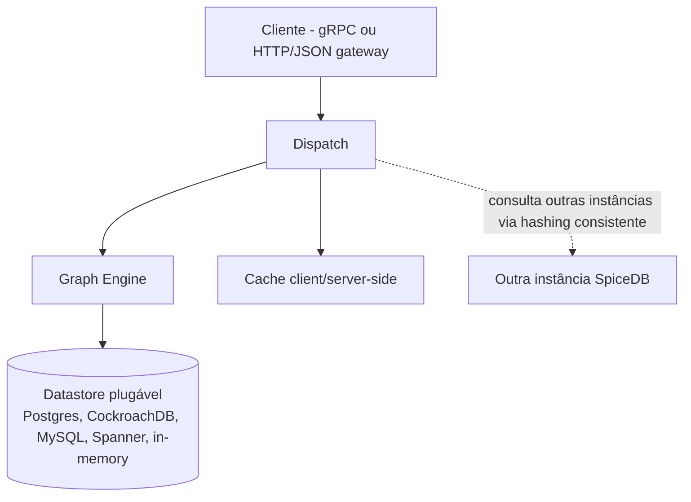

# O que é o SpiceDB (e por que ReBAC, ABAC e a Netflix aparecem nessa história)

> Artigo 1 de 4. Este explica os conceitos gerais — de onde o SpiceDB
> vem, o que é ReBAC, o que é ABAC, e como a Netflix usa (e não usa)
> cada um. Os próximos artigos em `.docs/` mostram como isso aparece no
> código desta POC (2), o que cada arquivo de configuração faz (3), e
> como os dados ficam guardados no Postgres (4). Há também uma collection
> do Postman (`spicedb-poc.postman_collection.json`, sem numeração — é
> ferramenta de teste, não artigo de leitura) com os cenários prontos.

## Para começar: o problema

Imagine um prédio com um porteiro. Toda vez que alguém quer entrar, o
porteiro precisa responder uma pergunta: "essa pessoa pode entrar
aqui?". Isso parece simples até você perceber quantas perguntas
diferentes um porteiro de verdade precisa saber responder: "mora
aqui?", "é visita de quem mora?", "é entregador, e tem uma encomenda de
verdade?", "é síndico, e pode entrar em qualquer sala?", "é o mesmo
morador que ontem, ou trocou de identidade?".

Sistemas de software gigantes — Google, Netflix, bancos — têm o mesmo
problema, só que multiplicado por milhões de "portas" (arquivos,
vídeos, contas, servidores) e milhões de "pessoas" (usuários, mas
também programas conversando com outros programas). E cada empresa,
historicamente, resolvia isso do seu jeito, espalhando a lógica de
"quem pode o quê" por dentro de cada sistema — o que funciona, até não
funcionar mais: fica caro de auditar, fácil de errar, e cada equipe
reinventa a roda.

Este artigo conta a história de duas famílias de solução para esse
problema — **ReBAC** e **ABAC** — e como elas colidem, de um jeito bem
concreto e documentado, dentro da própria Netflix.

---

## O ancestral disso tudo: o paper Zanzibar, do Google

Em 2019, o Google publicou um paper contando como resolveu esse
problema internamente, para produtos como Google Drive, Calendar, Maps,
Photos e YouTube — todos precisando de "quem pode ver o quê" de um jeito
consistente, respondido em milissegundos, bilhões de vezes por dia:

> **"Zanzibar: Google's Consistent, Global Authorization System"**
> Ruoming Pang, Ramon Caceres, Mike Burrows, Zhifeng Chen, Pratik Dave,
> Nathan Germer, Alexander Golynski, Kevin Graney, Nina Kang, Lea
> Kissner, Jeffrey L. Korn, Abhishek Parmar, Christina D. Richards,
> Mengzhi Wang — USENIX ATC '19.
> Paper oficial: <https://research.google/pubs/zanzibar-googles-consistent-global-authorization-system/>
> Apresentação na USENIX: <https://www.usenix.org/conference/atc19/presentation/pang>

O Zanzibar resolvia isso com uma ideia central, que hoje é o alicerce de
todo o "estilo ReBAC": **em vez de cada aplicativo guardar sua própria
lógica de permissão, existe um serviço só, guardando relações entre
coisas** — "esta pasta pertence a esta conta", "este documento está
dentro desta pasta", "esta pessoa é editora desta pasta" — e um jeito
padrão de fazer perguntas sobre esse grafo de relações. Três conceitos
que o paper introduziu (nomes conforme o glossário oficial do SpiceDB,
que explica a herança do Zanzibar em
<https://authzed.com/docs/spicedb/concepts/zanzibar>):

- **Relation tuples** — a peça básica: "sujeito A tem a relação R com o
  objeto B" (no SpiceDB, isso se chama **Relationship**).
- **Namespaces** — como cada tipo de objeto e suas relações possíveis
  são definidos (no SpiceDB, **Object Types**, com uma linguagem de
  schema própria chamada `zed` em vez de arquivos de configuração).
- **Zookies** — um mecanismo para resolver o "New Enemy Problem": evitar
  que alguém veja um dado que acabou de perder acesso, só porque a
  informação de permissão ainda não tinha "chegado" no momento da
  consulta. No SpiceDB, o equivalente se chama **ZedToken**.

O paper reporta números de escala que explicam por que essa ideia
pegou: trilhões de relações, milhões de consultas por segundo, p95 abaixo
de 10 milissegundos, e mais de 99,999% de disponibilidade ao longo de 3
anos em produção.

O SpiceDB (o motor que esta POC usa) é, literalmente, uma implementação
**open-source, inspirada no Zanzibar** — trazendo a mesma ideia central
para fora do Google.

---

## ReBAC: autorização como um mapa de relações

**ReBAC (Relationship-Based Access Control)** é o nome da família de
sistemas que o Zanzibar inaugurou: permissão como consequência de
**relações entre entidades**, não de uma lista fixa de papéis.

> "Under ReBAC, permissions are granted based on the relationships
> between the entities involved (…) e.g., a user might be granted
> access to a document if they have a relationship with the folder in
> which the document resides."
> — Permit.io, <https://www.permit.io/blog/what-is-rebac>

A diferença prática em relação ao RBAC tradicional (onde cada pessoa
tem "papéis" globais, tipo "Admin" ou "Editor"): RBAC tende a sofrer de
**"explosão de papéis"** — cada novo caso de uso vira um papel novo
("Editor-da-Pasta-X", "Editor-da-Pasta-Y"...). ReBAC resolve isso
modelando a permissão **por relação com o recurso específico**, não por
papel global. Uma citação direta e forte disso, do time do OpenFGA
(outro motor de autorização inspirado em Zanzibar):

> "ReBAC is a superset of RBAC and natively covers ABAC scenarios when
> attributes are expressed as relationships."
> — <https://openfga.dev/docs/authorization-concepts>

Ou seja: em teoria, dá pra "forçar" cenários de ABAC dentro de um
sistema ReBAC — desde que você transforme cada atributo em uma relação.
Só que, como o próprio caso da Netflix mostra mais abaixo, isso nem
sempre é uma boa ideia na prática.

---

## ABAC: autorização como avaliação de atributos, na hora

**ABAC (Attribute-Based Access Control)** é a outra família — e tem
até uma definição formal do governo americano, no NIST:

> "ABAC is a logical access control methodology where authorization to
> perform a set of operations is determined by evaluating attributes
> associated with the subject, object, requested operations, and, in
> some cases, environment conditions against policy, rules, or
> relationships."
> — NIST Special Publication 800-162,
> <https://csrc.nist.gov/pubs/sp/800/162/upd2/final>

Em vez de perguntar "existe uma relação escrita entre A e B?", o ABAC
pergunta "quais são os atributos de A, de B, e do ambiente agora — e a
política permite essa combinação?". O NIST formaliza isso em 4 peças
(PEP/PDP/PIP/PAP: ponto de aplicação, ponto de decisão, ponto de
informação, ponto de administração da política) — mas a ideia central
cabe numa frase: **a decisão é calculada na hora, a partir de atributos
frescos**, não lida de uma relação pré-escrita.

Um exemplo do próprio time do OpenFGA, comparando os dois: "marketing
manager can publish marketing posts" é ABAC (depende do atributo "cargo
= marketing manager" e do atributo "categoria do post = marketing");
"Alice pode editar o Documento X porque é dona da pasta que contém X" é
ReBAC.

---

## Dá pra ter os dois ao mesmo tempo? Sim — e é isso que a Netflix pediu

Aqui a história fica interessante. O SpiceDB (ReBAC "puro" por
natureza) ganhou, em algum momento, uma feature chamada **Caveats** —
que a própria documentação oficial descreve assim:

> "Caveats allow for an elegant way to model dynamic policies and
> ABAC-style (Attribute Based Access Control) decisions while still
> providing scalability and performance guarantees."
> — <https://authzed.com/docs/spicedb/concepts/caveats>

Uma "caveat" é uma condição, escrita em CEL (Common Expression
Language, a mesma linguagem de expressões usada em várias ferramentas
do Google/Kubernetes), anexada a uma relação — avaliada só na hora da
checagem, com os atributos daquele momento. Um exemplo real da
documentação: uma relação `viewer` que só vale `user with
has_valid_ip`, onde `has_valid_ip` checa se o IP de quem pergunta está
dentro de uma faixa permitida.

Esta POC implementa o mesmo padrão, com uma condição de região
geográfica em vez de IP — testado ao vivo, não só citado. Ver
`.docs/02-como-o-spicedb-funciona-nesta-poc.md`, seção "Caveats na
prática".

Isso não foi um capricho de arquitetura — **foi a Netflix que
patrocinou o desenvolvimento dessa feature**, e contou por quê, num
artigo público:

> **"ABAC on SpiceDB: Enabling Netflix's Complex Identity Types"**
> Chris Wolfe, Joey Schorr, Victor Roldán Betancort — Netflix
> TechBlog, 19 de maio de 2023.
> <https://netflixtechblog.com/abac-on-spicedb-enabling-netflixs-complex-identity-types-c118f374fa89>
> (republicado também em <https://authzed.com/blog/abac-on-spicedb-enabling-netflix-complex-identity-types>,
> case study em <https://authzed.com/customers/netflix>)

O problema que a Netflix tinha era autorizar **identidades de
aplicação** — não pessoas, e sim coisas do tipo "esta instância
específica do serviço Data Processor, rodando em `eu-west-1`, em
ambiente de teste, dentro de um shard público". Modelar isso em ReBAC
"puro" significaria escrever uma relação nova pra cada combinação de
atributo (região, ambiente, conta, shard), ingerir eventos toda vez que
um autoscaler criasse uma instância nova, e manter um processo de
limpeza de relações obsoletas. Pior: se o dado de relação ainda não
tivesse chegado (uma corrida entre "a instância nasceu" e "a relação foi
escrita"), o sistema **negava acesso indevidamente** — uma falha ruim de
se ter num sistema crítico. A saída foi justamente permitir que essa
lógica fosse expressa como condição avaliada na hora (ABAC), dentro do
mesmo motor ReBAC — daí o nome do artigo, "ABAC on SpiceDB".

### E a autorização dos usuários da Netflix (assinantes)? É outro sistema.

Aqui vale uma correção importante, porque é fácil confundir: o
trabalho acima é sobre autorizar **serviços/infraestrutura interna**,
não sobre "a Alice pode assistir a este filme". Para autorização
voltada a **membros/assinantes**, a Netflix tem um sistema **separado**,
apresentado publicamente como **PACS**, numa palestra:

> **"Authorization at Netflix Scale"** — Travis Nelson (Netflix, time
> AIM), QCon Plus 2022.
> <https://www.infoq.com/presentations/authorization-scalability/>

PACS é descrito como um serviço de autorização centralizado (antes,
cada microserviço da Netflix reimplementava sua própria lógica de
permissão), que avalia sinais como status da conta, plano de assinatura,
identidade do dispositivo, sinais de fraude e localização — com cache
em duas camadas (local + Memcached distribuído) e um modo de emergência
que cai para autorização local se o serviço central falhar. É, na
descrição da própria talk, um sistema fortemente orientado a atributos
— na prática, um primo do ABAC, ainda que não fique claro publicamente
se ele é implementado sobre o SpiceDB ou sobre outra base própria.

**Importante para não tirar uma conclusão maior do que os fatos
sustentam:** PACS é um sistema **interno e proprietário** da Netflix —
não é um produto, biblioteca ou serviço que exista fora da empresa.
Diferente do SpiceDB, ninguém "adota" o PACS; a comparação útil aqui é
entre **abordagens** (ReBAC vs. ABAC), não entre duas ferramentas
concorrentes das quais dá pra escolher uma. E, mais importante ainda:
**não existe fonte que confirme que a Netflix avaliou ReBAC para
autorização de assinante e decidiu por ABAC/PACS no lugar.** A talk do
PACS é de 2022; o artigo de Caveats é de 2023; e são tratados aqui como
dois domínios diferentes (infraestrutura vs. assinante). É perfeitamente
possível que o PACS simplesmente seja anterior à adoção do SpiceDB na
empresa, ou pertença a um time totalmente diferente, sem que nunca tenha
havido uma decisão consciente "ReBAC não serve aqui, vamos de ABAC". Não
force essa leitura além do que as fontes garantem.

**Outras duas ressalvas de honestidade, que a pesquisa para este artigo
deixou explícitas:**

1. Não existe fonte primária conectando PACS diretamente ao SpiceDB —
   são tratados aqui como **dois sistemas/domínios distintos** dentro
   da Netflix (autorização de infraestrutura vs. autorização de
   assinante), não a mesma coisa.
2. A sigla PACS aparece com expansões diferentes em fontes secundárias,
   sem uma página oficial da Netflix confirmando o nome por extenso —
   por isso este artigo usa só a sigla, sem "traduzi-la" com falsa
   certeza. Da mesma forma, o exemplo de "household sharing" (extra
   member pagando por fora do plano) aparece em posts de terceiros (um
   fornecedor concorrente, Aserto) como ilustração de ABAC na Netflix,
   mas sem confirmação direta de que é o mesmo projeto do artigo do
   TechBlog — é citado aqui só como contraste, não como fato de
   primeira mão.

---

## A arquitetura do SpiceDB, por dentro

Fontes: <https://authzed.com/blog/spicedb-architecture>,
<https://authzed.com/docs/spicedb/feature-overview>,
<https://deepwiki.com/authzed/spicedb/2-architecture>

- **Camada de API** — gRPC nativo, mais um gateway HTTP/JSON para
  ambientes que não falam HTTP/2.
- **Graph Engine** — o motor que percorre o grafo de schema + relações
  para responder "esta permissão vale?".
- **Dispatch** — coordena as três operações centrais (Check, Expand,
  Lookup), quebra uma pergunta grande em sub-perguntas menores e
  cacheáveis, e roteia entre instâncias do próprio SpiceDB quando ele
  roda em cluster.
- **Cache** — o mesmo mecanismo de cache serve tanto o lado cliente
  quanto o servidor, dependendo de onde é posicionado no pipeline.
- **Datastore plugável** — PostgreSQL (o que esta POC usa), CockroachDB,
  MySQL, Google Spanner, ou até um modo em memória para testes.

E a própria documentação oficial já avisa qual é o preço de tudo isso:

> "SpiceDB is an open-source, Google Zanzibar-inspired database system
> for real-time, security-critical application permissions." — mas
> também: "In some scenarios, SpiceDB can be challenging to operate
> because it is a **critical, low-latency, distributed system**."
> — <https://authzed.com/docs/spicedb/feature-overview>

Ou seja: o SpiceDB brilha quando autorização virou complexa/crítica o
suficiente para merecer um sistema dedicado — e cobra o preço de operar
mais uma peça de infraestrutura distribuída e sensível a latência.

---

## Amarrando tudo com esta POC: ReBAC é o encaixe certo aqui?

Esta POC não está tentando replicar o PACS da Netflix (autorização de
assinante em escala planetária, que nem é um produto adotável — é
sistema interno deles) nem a escala do caso de identidades de aplicação
do artigo de Caveats. Testa o cenário mais comum de entitlement — plano
de assinatura, produto avulso, tag de conteúdo, concessão direta — **e
também** já testa, num exemplo pequeno e real (não só citado), o
caminho de saída quando isso não basta: atributo avaliado na hora, via
Caveats. O veredito, sem enfeitar:

**Para o núcleo do que esta POC modela, ReBAC é um bom encaixe.** Plano
de assinatura, produto avulso comprado, tag de conteúdo liberada, acesso
direto — todos são **relações estáveis**: fatos que passam a existir
quando um evento de negócio acontece (assinar, comprar, liberar) e
continuam válidos até mudarem de novo. Isso não é um atributo que muda
a cada requisição — é exatamente o tipo de dado que um grafo de relações
foi desenhado para responder bem, com múltiplos caminhos para a mesma
permissão resolvidos de forma nativa. Não por acaso, um catálogo com
planos por assinatura é um dos exemplos que a própria Authzed usa para
demonstrar o SpiceDB.

**Onde isso deixaria de ser suficiente — e o que fizemos a respeito:**
se o problema real da empresa precisar de decisões que dependem de
**atributos avaliados na hora** — licenciamento por região geográfica
(que muda com acordos comerciais, não é uma relação fixa), sinais de
fraude, tipo de dispositivo, ou janelas de tempo de uma promoção — ReBAC
puro passa a forçar a barra: você teria que escrever (e manter
atualizada) uma relação para cada combinação de atributo, em vez de
avaliar a condição no momento da pergunta. A resposta documentada para
esse problema não é abandonar o SpiceDB por outra coisa — é o que a
própria Netflix fez: estender o SpiceDB com Caveats. **Esta POC já
implementou e testou ao vivo exatamente esse caminho de saída**: uma
relação `movie.region_locked_viewer`, restrita por região geográfica,
onde a mesma tupla gravada uma única vez responde `true` ou `false`
dependendo do atributo enviado no momento da checagem — ver
`.docs/02-como-o-spicedb-funciona-nesta-poc.md`, seção "Caveats na
prática", para o schema, o código e os comandos `curl` que provam isso
rodando. Não existe, nas fontes usadas aqui, nenhuma evidência de que a
Netflix tenha avaliado ReBAC para autorização de assinante e o
descartado em favor de um sistema totalmente diferente — essa é uma
inferência forte demais para os fatos disponíveis, e este artigo evita
fazê-la.

Em resumo: **SpiceDB/ReBAC resolve bem o núcleo de entitlement desta
POC, e o caminho de evolução para atributo dinâmico (Caveats) não é
mais só teoria — já foi implementado e verificado aqui.** Se o escopo
real da empresa precisar desses atributos, o caminho com precedente
documentado (Netflix) e agora também com precedente próprio (esta POC)
é estender com Caveats, não trocar de abordagem.

Ver `.docs/02-como-o-spicedb-funciona-nesta-poc.md` para como isso vira
código, schema e tabelas, nesta implementação específica.
