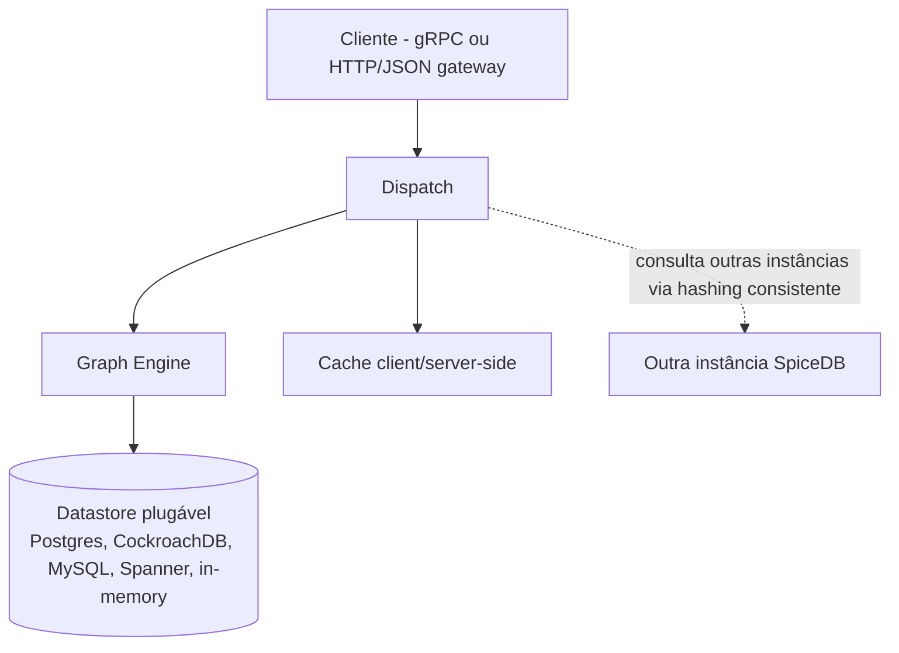

# O que é o SpiceDB: origem, ReBAC, ABAC e o caso Netflix

> Artigo 1 de 4. Fundamentos conceituais — origem do SpiceDB, definição
> de ReBAC e ABAC, e o caso documentado da Netflix. Os artigos seguintes
> tratam da implementação nesta POC (2), dos arquivos de configuração
> (3) e do formato de armazenamento no Postgres (4). Uma collection do
> Postman (`spicedb-poc.postman_collection.json`) acompanha o
> repositório como ferramenta de teste, não como material de leitura.

## Escopo do problema

Sistemas de autorização respondem a uma pergunta recorrente: dado um
sujeito, uma ação e um recurso, a operação é permitida? Em escala —
múltiplos serviços, múltiplos tipos de recurso, múltiplas regras de
negócio — essa lógica tende a ser implementada de forma ad hoc,
distribuída pelo código de cada aplicação. O resultado observado por
organizações que atingem essa escala (Google e Netflix, entre as fontes
citadas abaixo) é auditabilidade reduzida e duplicação de esforço entre
equipes.

Este artigo descreve duas famílias de solução para esse problema —
**ReBAC** e **ABAC** — e um caso documentado em que ambas coexistem
dentro da mesma organização.

---

## Origem: o paper Zanzibar (Google, 2019)

O Google publicou em 2019 a descrição do sistema de autorização usado
internamente por produtos como Drive, Calendar, Maps, Photos e YouTube:

> **"Zanzibar: Google's Consistent, Global Authorization System"**
> Ruoming Pang, Ramon Caceres, Mike Burrows, Zhifeng Chen, Pratik Dave,
> Nathan Germer, Alexander Golynski, Kevin Graney, Nina Kang, Lea
> Kissner, Jeffrey L. Korn, Abhishek Parmar, Christina D. Richards,
> Mengzhi Wang — USENIX ATC '19.
> Paper: <https://research.google/pubs/zanzibar-googles-consistent-global-authorization-system/>
> Apresentação: <https://www.usenix.org/conference/atc19/presentation/pang>

A proposta central — hoje a base do que se convencionou chamar de
ReBAC — consiste em centralizar a lógica de permissão num serviço único,
que armazena relações entre entidades ("pasta pertence a conta",
"documento está dentro de pasta") e expõe uma interface padronizada de
consulta sobre esse grafo. O paper introduz três conceitos (nomes
correspondentes na terminologia do SpiceDB, conforme
<https://authzed.com/docs/spicedb/concepts/zanzibar>):

- **Relation tuples** — unidade básica: "sujeito A relaciona-se por R
  com o objeto B" (SpiceDB: **Relationship**).
- **Namespaces** — definição de tipos de objeto e suas relações
  possíveis (SpiceDB: **Object Types**, expressos numa linguagem de
  schema própria, `zed`).
- **Zookies** — mecanismo de consistência que evita o "New Enemy
  Problem" (leitura de permissão desatualizada em relação a uma escrita
  concorrente). Equivalente no SpiceDB: **ZedToken**.

O paper reporta, em produção, trilhões de relações, milhões de consultas
por segundo, p95 abaixo de 10ms e disponibilidade superior a 99,999% ao
longo de três anos. O SpiceDB é uma implementação open-source inspirada
diretamente nesse modelo.

---

## ReBAC: permissão como função de relações

**ReBAC (Relationship-Based Access Control)** condiciona a permissão à
existência de relações entre entidades, não a uma lista fixa de papéis:

> "Under ReBAC, permissions are granted based on the relationships
> between the entities involved (…) e.g., a user might be granted
> access to a document if they have a relationship with the folder in
> which the document resides."
> — Permit.io, <https://www.permit.io/blog/what-is-rebac>

A distinção em relação ao RBAC tradicional (papéis globais como "Admin"
ou "Editor") é que RBAC tende à "explosão de papéis" — um papel novo por
combinação de caso de uso — enquanto ReBAC modela a permissão por
relação com o recurso específico. O time do OpenFGA (outro motor
inspirado em Zanzibar) resume a relação entre os dois modelos:

> "ReBAC is a superset of RBAC and natively covers ABAC scenarios when
> attributes are expressed as relationships."
> — <https://openfga.dev/docs/authorization-concepts>

Isto é, cenários de ABAC podem, em princípio, ser expressos em ReBAC
convertendo cada atributo em relação — uma conversão que, como o caso
da Netflix demonstra adiante, nem sempre é apropriada.

---

## ABAC: permissão como avaliação de atributos

**ABAC (Attribute-Based Access Control)** possui definição formal no
NIST:

> "ABAC is a logical access control methodology where authorization to
> perform a set of operations is determined by evaluating attributes
> associated with the subject, object, requested operations, and, in
> some cases, environment conditions against policy, rules, or
> relationships."
> — NIST Special Publication 800-162,
> <https://csrc.nist.gov/pubs/sp/800/162/upd2/final>

Em vez de verificar a existência de uma relação pré-escrita, ABAC avalia
atributos do sujeito, do objeto e do ambiente no momento da decisão,
segundo um modelo de quatro componentes (PEP/PDP/PIP/PAP — pontos de
aplicação, decisão, informação e administração de política). A distinção
central é temporal: a decisão em ABAC é computada a partir de atributos
correntes; em ReBAC, a partir de fatos já persistidos.

---

## Coexistência dos dois modelos: o caso Netflix

O SpiceDB — nativamente ReBAC — incorpora um mecanismo de avaliação de
atributos em tempo de checagem, denominado **Caveats**:

> "Caveats allow for an elegant way to model dynamic policies and
> ABAC-style (Attribute Based Access Control) decisions while still
> providing scalability and performance guarantees."
> — <https://authzed.com/docs/spicedb/concepts/caveats>

Uma caveat é uma expressão em CEL (Common Expression Language) anexada
a uma relação, avaliada apenas no momento do `CheckPermission`, com os
atributos fornecidos naquele momento — por exemplo, uma relação `viewer`
condicionada a `has_valid_ip`, que restringe o acesso por faixa de IP. A
Seção "Caveats na prática" do artigo 2 descreve a implementação
equivalente, com condição de região geográfica, verificada nesta POC.

O desenvolvimento dessa funcionalidade foi patrocinado pela Netflix, que
documentou publicamente a motivação:

> **"ABAC on SpiceDB: Enabling Netflix's Complex Identity Types"**
> Chris Wolfe, Joey Schorr, Victor Roldán Betancort — Netflix
> TechBlog, 19 de maio de 2023.
> <https://netflixtechblog.com/abac-on-spicedb-enabling-netflixs-complex-identity-types-c118f374fa89>
> (republicado em <https://authzed.com/blog/abac-on-spicedb-enabling-netflix-complex-identity-types>;
> estudo de caso em <https://authzed.com/customers/netflix>)

O problema descrito é a autorização de **identidades de aplicação**
(por exemplo, uma instância do serviço Data Processor em `eu-west-1`,
ambiente de teste, shard público) — não de usuários finais. Modelar esse
cenário em ReBAC puro exigiria uma relação por combinação de atributo
(região, ambiente, conta, shard), ingestão de eventos a cada
autoscaling e um processo de limpeza de relações obsoletas; adicionalmente,
condições de corrida entre a criação da instância e o registro da
relação resultavam em negação indevida de acesso. A solução adotada
substitui parte dessa lógica por condições avaliadas em tempo de
checagem — origem do título "ABAC on SpiceDB".

### Autorização de assinantes: um sistema distinto

O trabalho descrito acima refere-se a infraestrutura, não à pergunta
"este assinante pode acessar este título". Para autorização de membros,
a Netflix apresentou publicamente um sistema separado, denominado PACS:

> **"Authorization at Netflix Scale"** — Travis Nelson (Netflix, time
> AIM), QCon Plus 2022.
> <https://www.infoq.com/presentations/authorization-scalability/>

PACS é descrito como serviço de autorização centralizado — anteriormente,
cada microsserviço replicava sua própria lógica — que avalia status de
conta, plano, identidade de dispositivo, sinais de fraude e localização,
com cache em duas camadas e modo de contingência local. Funcionalmente,
aproxima-se de ABAC, embora não haja confirmação pública de que sua
implementação utilize o SpiceDB.

Duas ressalvas quanto às fontes, para não sustentar conclusão além do
que os dados permitem: (1) não há fonte primária que associe PACS ao
SpiceDB — são tratados aqui como sistemas distintos (autorização de
infraestrutura versus autorização de assinante), e não há evidência de
que a Netflix tenha avaliado ReBAC para o segundo caso e optado por
ABAC em seu lugar — a apresentação do PACS (2022) antecede o artigo de
Caveats (2023), o que é compatível com sistemas independentes,
desenvolvidos por equipes distintas, sem decisão comparativa entre os
dois modelos; (2) a sigla PACS aparece com expansões divergentes em
fontes secundárias, sem confirmação oficial — por isso é usada aqui sem
expansão. O exemplo de "household sharing" ocasionalmente associado a
ABAC na Netflix provém de terceiros (um fornecedor concorrente) e não é
tratado como fato de primeira mão.

---

## Arquitetura do SpiceDB

Fontes: <https://authzed.com/blog/spicedb-architecture>,
<https://authzed.com/docs/spicedb/feature-overview>,
<https://deepwiki.com/authzed/spicedb/2-architecture>.

- **Camada de API** — gRPC nativo e gateway HTTP/JSON.
- **Graph Engine** — percorre o grafo de schema e relações para resolver
  uma consulta de permissão.
- **Dispatch** — coordena as operações Check, Expand e Lookup,
  decompõe consultas em subproblemas cacheáveis e roteia entre
  instâncias em topologia de cluster.
- **Cache** — mecanismo único, aplicável tanto no cliente quanto no
  servidor conforme posicionamento no pipeline.
- **Datastore plugável** — PostgreSQL (usado nesta POC), CockroachDB,
  MySQL, Google Spanner, ou modo em memória para testes.

A documentação oficial delimita o escopo de aplicabilidade:

> "SpiceDB is an open-source, Google Zanzibar-inspired database system
> for real-time, security-critical application permissions." [...]
> "In some scenarios, SpiceDB can be challenging to operate because it
> is a **critical, low-latency, distributed system**."
> — <https://authzed.com/docs/spicedb/feature-overview>

Ou seja: adequação recomendada para autorização suficientemente
complexa ou crítica para justificar um sistema dedicado, com o custo
operacional correspondente de um componente distribuído sensível a
latência.

---

## Adequação de ReBAC ao escopo desta POC

Esta POC não reproduz a escala do PACS nem do caso de identidades de
aplicação da Netflix — ambos fora de escopo. Ela cobre o cenário mais
comum de modelagem de entitlement (plano de assinatura, produto avulso,
tag de conteúdo, concessão direta) e, adicionalmente, uma instância
verificada de extensão via Caveats.

Para o núcleo modelado, ReBAC é adequado: assinatura, compra e concessão
são **relações estáveis** — fatos que passam a existir com um evento de
negócio e permanecem válidos até nova alteração, não atributos recalculados
a cada requisição. Esse é o padrão de dado para o qual um grafo de
relações foi projetado, incluindo a resolução nativa de múltiplos
caminhos para uma mesma permissão; um catálogo de planos de assinatura
é, não coincidentemente, um dos exemplos usados pela própria Authzed
para demonstrar o SpiceDB.

A adequação declina quando a decisão depende de atributos avaliados no
momento da requisição — licenciamento por região geográfica, sinais de
fraude, tipo de dispositivo, janelas de tempo promocionais. Nesses
casos, ReBAC puro exige uma relação por combinação de atributo,
com custo de manutenção crescente. O precedente documentado (Netflix)
para esse problema é a extensão do modelo ReBAC com Caveats, não a
substituição do sistema. Esta POC implementa e verifica essa mesma
extensão — uma relação `movie.region_locked_viewer` cuja tupla, escrita
uma única vez, produz resultado distinto conforme o atributo de região
fornecido a cada checagem (detalhes no artigo 2, seção "Caveats na
prática").

Não há, nas fontes consultadas, evidência de que a Netflix tenha
avaliado ReBAC para autorização de assinante e descartado essa opção em
favor de ABAC; tal inferência excede o que os dados sustentam. O que se
sustenta é o inverso: quando a organização necessitou de avaliação de
atributos dentro de um sistema ReBAC já em produção, a solução adotada
foi estender o mecanismo existente — precedente agora replicado, em
escala reduzida, nesta implementação.
