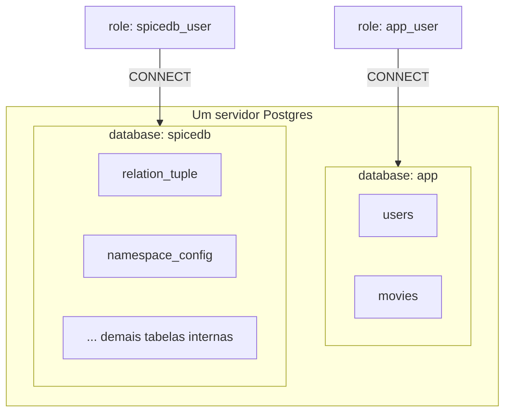
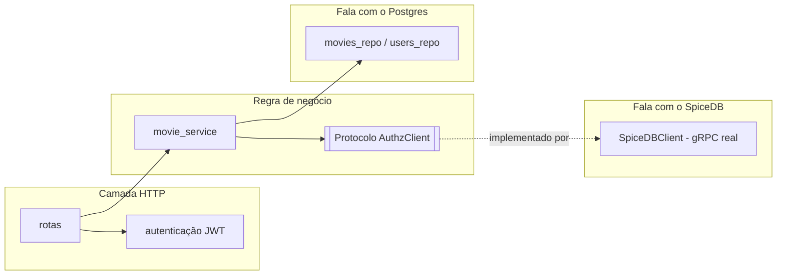
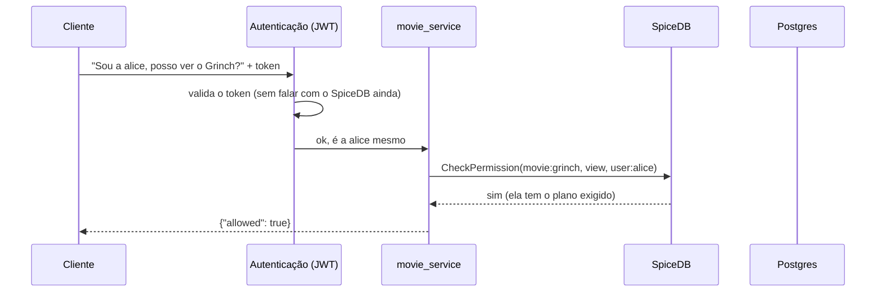

# Implementação do SpiceDB nesta POC

> Artigo 2 de 4. O artigo 1 trata dos fundamentos conceituais (ReBAC,
> ABAC, Zanzibar, caso Netflix). Este descreve a implementação concreta
> nesta POC — schema, código, fluxo de requisição e o exemplo de
> Caveats verificado no repositório. Os artigos seguintes tratam dos
> arquivos de configuração (3) e do formato de armazenamento no
> Postgres (4). A collection do Postman
> (`spicedb-poc.postman_collection.json`) reproduz os cenários descritos
> aqui.

## Problema modelado

Um serviço de streaming típico já possui um banco de dados de usuários
e catálogo — essa parte não constitui dificuldade. A dificuldade está em
responder, de forma consistente, à pergunta "este usuário pode acessar
este título, agora?". A implementação convencional distribui essa
lógica pelo código de aplicação (uma condição por plano, uma por compra
avulsa, uma por promoção, uma por concessão excepcional), o que reduz a
auditabilidade da regra de acesso agregada.

Esta POC testa uma alternativa: tratar "quem pode acessar o quê" como
uma consulta a um sistema especializado em relações, com a regra
declarada uma única vez, em vez de recalculada a cada trecho de código
que a invoca. A questão de interesse não é se o SpiceDB opera
tecnicamente — isso está estabelecido —, mas se a modelagem por grafo de
relações resulta em regra de acesso mais auditável e evolutiva do que a
alternativa distribuída.

---

## Entidades do domínio

- **`user`** — usuário (`alice`, `bob`).
- **`plan`** — plano de assinatura (`basic`, `medium`, `premium`), em
  ordem crescente de acesso.
- **`commercial_product`** — produto adquirido avulsamente, fora do
  plano (ex.: promoção sazonal).
- **`content_tag`** — categoria de conteúdo, liberável por mais de um
  caminho.
- **`movie`** — recurso final. A permissão `view` é satisfeita por
  quatro vias: plano, tag, concessão direta, ou condição de Caveat
  (detalhada adiante).

Duas tabelas relacionais convencionais complementam o modelo, sem
participar da decisão de autorização:

- **`movies`** (`id`, `title`, `synopsis`, `genre`, `release_year`,
  `duration_minutes`) — metadados de catálogo.
- **`users`** (`id`, `email`, `display_name`, `country`, `created_at`)
  — metadados de perfil. `country` é um atributo de cadastro, não
  utilizado por nenhuma checagem de autorização — o exemplo de Caveat
  descrito adiante recebe a região como parâmetro explícito da
  requisição, não a partir desta coluna; a distinção é relevante e
  retomada na seção correspondente.

Nem `movies` nem `users` armazenam informação de autorização: essa
informação reside inteiramente no grafo de relações do SpiceDB.

---

## Separação de armazenamento

A POC utiliza uma única instância de Postgres com duas databases
isoladas, cada uma com credencial própria e sem privilégio de conexão
cruzada:



Três motivações justificam a separação, em vez de uma única database
compartilhada:

1. **Propriedade das tabelas.** As tabelas da database `spicedb`
   (`relation_tuple`, `namespace_config`, `caveat`,
   `relation_tuple_transaction`, entre outras — estrutura e exemplos
   reais em `04-como-o-spicedb-guarda-dados-no-postgres.md`) são geridas
   exclusivamente pelo binário do SpiceDB via `spicedb migrate head`. O
   código da aplicação não executa `SELECT` nessas tabelas; toda
   interação ocorre via API gRPC.
2. **Contenção de comprometimento de credencial.** Exposição da
   credencial `app_user` permite leitura de `movies`/`users`, mas não
   concede acesso ao grafo de permissões, dado que `app_user` não possui
   `CONNECT` na database `spicedb` — aplicação do princípio de menor
   privilégio na fronteira do banco.
3. **Compatibilidade com infraestrutura pré-existente.** Em uma
   organização que já opera um Postgres de produção, a questão prática
   é se o SpiceDB pode ser incorporado sem interferir nos dados
   existentes. Esta POC verifica que sim, na mesma instância, em
   database dedicada.

---

## Schema: declaração da regra de autorização

O arquivo `app/resources/schema.zed` é o único ponto de declaração da
regra de acesso, em linguagem própria do SpiceDB:

```zed
definition movie {
    relation required_plan: plan
    relation tag: content_tag
    relation direct_viewer: user
    relation region_locked_viewer: user with region_allowed
    permission view = (required_plan->is_member) + (tag->has_access) + direct_viewer + region_locked_viewer
}
```

A permissão `view` resolve-se por quatro caminhos independentes:
associação ao plano exigido, acesso à tag do título por via alternativa
(ex.: produto avulso), concessão direta, ou satisfação de uma condição
de Caveat. Essa resolução por união de múltiplos caminhos é um padrão
característico de ReBAC (fundamentação no artigo 1).

Um aspecto relevante, identificado durante a implementação: a direção
da relação `inherits` entre planos determina a semântica de herança. A
intenção — assinante de plano superior satisfaz automaticamente os
planos inferiores — exige que o plano *inferior* aponte `inherits` para
o *superior* (`plan:basic --inherits--> plan:medium`); a direção
inversa produz o efeito oposto. A modelagem por grafo não elimina erro
de especificação, mas o torna explícito e verificável numa tupla de
relação, em contraste com uma condição implícita em código imperativo.

---

## Caveats: verificação de atributo em tempo de checagem

O artigo 1 descreve Caveats em termos conceituais. Esta seção documenta
a implementação verificada nesta POC.

Condição declarada no schema:

```zed
caveat region_allowed(user_region string, allowed_regions list<string>) {
    user_region in allowed_regions
}
```

O parâmetro `allowed_regions` é persistido junto à relação, no momento
de sua escrita — um dado estático, análogo a qualquer outra tupla.
`user_region` não é persistido em nenhum ponto: existe apenas como
parâmetro da chamada `CheckPermission`. Essa diferença — momento em que
cada valor se torna disponível — é o critério que distingue ABAC de
ReBAC.

Relação de seed para o título `filme_regional`, liberado para `alice`
em Brasil e Argentina:

```clojure
{:resource-type "movie" :resource-id "filme_regional" :relation "region_locked_viewer"
 :subject-type "user" :subject-id "alice"
 :caveat {:name "region_allowed" :context {:allowed_regions ["BR" "AR"]}}}
```

A rota HTTP repassa a região informada na requisição (`?region=`) como
atributo de checagem — não é lida de coluna alguma do Postgres,
simulando o que, em produção, corresponderia a geolocalização por IP:

```clojure
(let [region (get-in request [:query-params :region])
      context (when region {:user_region region})]
  (movie-service/can-view? system {:user-id user-id :movie-id movie-id} context))
```

Resultado observado, para a mesma tupla persistida:

```bash
curl "http://localhost:3000/movies/filme_regional/access" \
  -H "Authorization: Bearer $ALICE_JWT"                       # {"allowed":false} — sem região, nega por padrão
curl "http://localhost:3000/movies/filme_regional/access?region=BR" \
  -H "Authorization: Bearer $ALICE_JWT"                       # {"allowed":true}
curl "http://localhost:3000/movies/filme_regional/access?region=US" \
  -H "Authorization: Bearer $ALICE_JWT"                       # {"allowed":false}
```

Quando o contexto necessário à avaliação da caveat não é fornecido, o
SpiceDB não pode confirmar a condição, e a ausência de resposta
positiva definitiva (`PERMISSIONSHIP_HAS_PERMISSION`) é tratada, nesta
implementação, como negação — o mesmo critério de negar por padrão
aplicado ao restante da POC.

A mesma rota de escrita de relações aceita uma caveat em tempo de
execução:

```bash
curl -X POST http://localhost:3000/relationships \
  -H "Authorization: Bearer $ALICE_JWT" -H "Content-Type: application/json" \
  -d '{"resource-type":"movie","resource-id":"filme_regional","relation":"region_locked_viewer",
       "subject-type":"user","subject-id":"bob",
       "caveat":{"name":"region_allowed","context":{"allowed_regions":["PT"]}}}'
```

---

## Organização do código



- **`domain/authz_client.clj`** — protocolo sem dependência de gRPC:
  quatro funções (`check-permission`, `lookup-resources`,
  `write-relationships!`, `write-schema!`) que definem o contrato de
  qualquer implementação de autorização. A regra de negócio
  (`movie_service`) depende apenas desse contrato, não de gRPC, Protobuf
  ou SpiceDB diretamente — isolando o ponto de mudança em caso de troca
  de motor.
- **`infra/spicedb/client.clj`** — implementação concreta do contrato,
  via protocolo gRPC do SpiceDB.
- **`domain/movie_service.clj`** — regra de negócio: `can-view?`
  (decisão booleana) e `available-movies` (lista de recursos acessíveis,
  obtida do SpiceDB e hidratada com metadados do Postgres).
- **`infra/http/*`** — camada HTTP (Pedestal) e interceptor de
  autenticação. Autenticação e autorização são deliberadamente
  desacopladas: um JWT inválido é rejeitado com `401` antes de qualquer
  consulta ao SpiceDB.

## Fluxo de uma requisição de autorização



O código Clojure não percorre a árvore de planos nem avalia condições
de herança: emite uma consulta e recebe uma resposta. A complexidade da
regra reside no schema, não no código que a invoca.

## Execução

```bash
make up                    # sobe tudo (gera .env com secrets de dev automaticamente)
make mint-token            # gera um token de teste pra alice
make mint-token USER_ID=bob

curl http://localhost:3000/movies/grinch/access -H "Authorization: Bearer <token>"
curl http://localhost:3000/available-movies -H "Authorization: Bearer <token>"

curl "http://localhost:3000/movies/filme_regional/access?region=BR" -H "Authorization: Bearer <token>"
curl "http://localhost:3000/movies/filme_regional/access?region=US" -H "Authorization: Bearer <token>"

make seed PROFILE=medium   # popula com volume (200 usuários, 80 filmes)
make bench PROFILE=medium  # mede latência das checagens de permissão

make reset                 # zera tudo (Postgres do zero)
```

Ver `README.md` na raiz do repositório para a lista completa de
comandos e cenários.

## Avaliação

A questão relevante não é se o SpiceDB opera corretamente, mas se a
substituição do modelo atual de autorização se justifica. Os elementos
observados nesta implementação, favoráveis à adoção: a regra de acesso
concentra-se num único artefato (`schema.zed`); alteração de uma
relação (por exemplo, concessão avulsa de acesso a um título) constitui
uma chamada de API, não uma alteração de código sujeita a novo deploy;
a separação entre autenticação e autorização é explícita na arquitetura;
e a evolução de ReBAC puro para Caveats, quando necessária, não requer
substituição do motor.

Custos identificados: um componente adicional em operação (o próprio
SpiceDB), uma linguagem de schema a ser aprendida (`zed`), e — como
evidenciado pelo erro de direção em `inherits` e, posteriormente, pelo
erro de invocação de `route/query-params` como função — a modelagem por
grafo e a integração via gRPC apresentam modos de falha próprios,
comparativamente mais visíveis e verificáveis do que uma condição
imperativa incorreta, mas não inexistentes.
