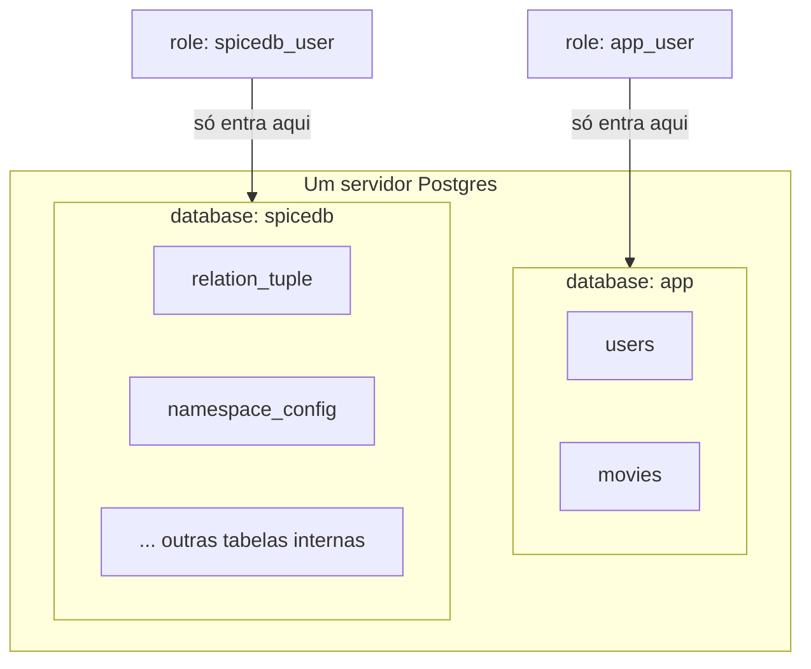
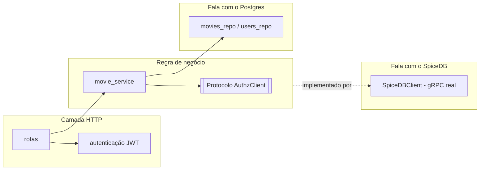
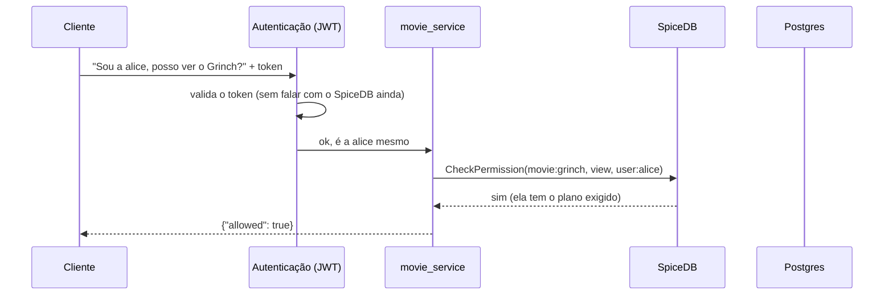

# Como o SpiceDB funciona nesta POC

> Artigo 2 de 5. O artigo 1 explica as ideias gerais (ReBAC, ABAC,
> Zanzibar, o caso da Netflix). Este aqui mostra exatamente como isso
> vira código, schema e tabelas nesta POC específica. Os próximos
> explicam os arquivos de configuração (3), como os dados ficam
> guardados no Postgres (4), e outras ferramentas parecidas com o
> SpiceDB (5). A collection do Postman
> (`spicedb-poc.postman_collection.json`) tem tudo pronto pra testar.

## O problema que esta POC resolve

Imagine um serviço de streaming. Ele já tem um banco de dados com
usuários e filmes — isso nunca foi problema. O problema é outra
pergunta: **"este usuário específico pode assistir a este filme
específico, agora?"**

O jeito comum de responder isso é espalhar a resposta pelo código: um
pedaço checa o plano, outro checa se a pessoa comprou aquele filme
avulso, outro checa uma promoção, outro ainda cobre o caso de alguém
que ganhou acesso de cortesia. Cada regra nova vira mais um pedaço de
código espalhado, e fica difícil confiar na resposta pra "quem pode ver
o quê" sem ler tudo de novo.

Esta POC testa uma ideia diferente: e se essa pergunta não fosse
calculada no código, e sim respondida por um banco de dados
especializado em relações, onde tudo já está escrito num lugar só? Esse
banco é o SpiceDB. A pergunta que interessa não é "o SpiceDB funciona"
— isso qualquer documentação garante — é: **esse jeito de guardar
autorização como um grafo de relações fica mais claro e mais fácil de
mudar do que espalhar `if`s pelo código?**

---

## As peças principais

- **`user`** — uma pessoa (`alice`, `bob`).
- **`plan`** — um plano de assinatura (`basic`, `medium`, `premium`),
  do mais simples pro mais completo.
- **`commercial_product`** — algo comprado avulso, fora do plano (ex.:
  uma promoção de Natal).
- **`content_tag`** — uma etiqueta de conteúdo (ex.: "filmes
  natalinos"), que pode ser liberada por mais de um caminho.
- **`movie`** — o filme em si. Pode ser visto por quatro caminhos: por
  plano, por tag, por concessão direta, ou por uma condição de
  **Caveat** (explicado mais abaixo).

E duas tabelas comuns de banco de dados, sem nada de especial:

- **`movies`** (`id`, `title`, `synopsis`, `genre`, `release_year`,
  `duration_minutes`) — o catálogo: o que existe.
- **`users`** (`id`, `email`, `display_name`, `country`, `created_at`)
  — quem existe. `country` aqui é só um dado de cadastro — nenhuma
  checagem de autorização olha pra essa coluna. O exemplo de Caveat mais
  abaixo usa uma região enviada na própria pergunta, não essa coluna —
  a diferença importa, e é explicada lá.

O ponto principal: **nem `movies` nem `users` guardam quem pode
acessar o quê.** Isso — o coração da autorização — não é uma coluna. É
um grafo de relações, e vive inteiro dentro do SpiceDB.

---

## Onde cada dado fica guardado

A POC roda com **um único Postgres**, mas com **duas databases
separadas dentro dele** — como duas gavetas de um mesmo armário, cada
uma com sua própria chave:



Por que separar assim?

1. **O SpiceDB é dono das próprias tabelas.** Tabelas como
   `relation_tuple`, `namespace_config` e `caveat` (ver detalhes em
   `04-como-o-spicedb-guarda-dados-no-postgres.md`) são geridas
   inteiramente pelo binário do SpiceDB. Ninguém no código Clojure faz
   `SELECT` nelas — toda conversa passa pela API do SpiceDB.
2. **Vazar uma credencial não vaza a autorização inteira.** Se a
   credencial da aplicação (`app_user`) vazar, dá pra ler
   `movies`/`users` — ruim, mas não dá pra tocar no grafo de permissões,
   porque `app_user` nem consegue entrar na database `spicedb`.
3. **É o cenário real que a POC quer provar.** Numa empresa que já tem
   um Postgres de produção, a pergunta é "dá pra colocar o SpiceDB do
   lado, sem bagunçar o que já existe?" — e a resposta é sim, na mesma
   instância, numa database separada.

---

## O schema: onde a regra vira grafo

O arquivo `app/resources/schema.zed` é o único lugar onde a regra de
"quem pode ver o quê" é escrita:

```zed
definition movie {
    relation required_plan: plan
    relation tag: content_tag
    relation direct_viewer: user
    relation region_locked_viewer: user with region_allowed
    permission view = (required_plan->is_member) + (tag->has_access) + direct_viewer + region_locked_viewer
}
```

Em português: "alguém pode `view` (ver) um filme se: tem o plano
exigido, OU tem acesso à tag do filme por outro caminho, OU foi
liberado direto, OU passa na condição de região." Quatro caminhos, um
resultado só.

Um detalhe que virou um erro real durante a implementação: a
**direção** da relação `inherits` entre planos importa. A ideia é
"quem tem o plano de cima também tem tudo do plano de baixo" — e isso
só funciona se o plano *de baixo* apontar `inherits` pro *de cima*
(`plan:basic --inherits--> plan:medium`), nunca o contrário. Guardar a
regra num grafo não impede erro — só troca "erro escondido num `if`"
por "erro visível numa tupla", o que já ajuda bastante, mas exige
prestar atenção na direção da seta.

---

## Caveats na prática: o mesmo dado, duas respostas diferentes

O artigo 1 explica Caveats na teoria. Aqui está o exemplo implementado
e conferido nesta POC.

Primeiro, a condição, escrita no schema:

```zed
caveat region_allowed(user_region string, allowed_regions list<string>) {
    user_region in allowed_regions
}
```

`allowed_regions` é gravado junto com a relação, no momento em que ela
é escrita — um dado fixo, igual qualquer outra tupla. `user_region`
**não fica guardado em lugar nenhum** — ele só existe no instante da
pergunta. É essa diferença de "quando o dado chega" que separa ABAC de
ReBAC.

Na seed, o filme `filme_regional` é liberado pra `alice`, só no Brasil
e na Argentina:

```clojure
{:resource-type "movie" :resource-id "filme_regional" :relation "region_locked_viewer"
 :subject-type "user" :subject-id "alice"
 :caveat {:name "region_allowed" :context {:allowed_regions ["BR" "AR"]}}}
```

A rota HTTP passa a região da requisição (`?region=`) como o dado do
momento — não lê nenhuma coluna do Postgres, é passado direto a cada
chamada, simulando o que num sistema real viria da localização por IP:

```clojure
(let [region (get-in request [:query-params :region])
      context (when region {:user_region region})]
  (movie-service/can-view? system {:user-id user-id :movie-id movie-id} context))
```

Resultado, pra essa mesma relação:

```bash
curl "http://localhost:3000/movies/filme_regional/access" \
  -H "Authorization: Bearer $ALICE_JWT"                       # {"allowed":false} — sem região, nega por padrão
curl "http://localhost:3000/movies/filme_regional/access?region=BR" \
  -H "Authorization: Bearer $ALICE_JWT"                       # {"allowed":true}
curl "http://localhost:3000/movies/filme_regional/access?region=US" \
  -H "Authorization: Bearer $ALICE_JWT"                       # {"allowed":false}
```

Sem região, a resposta é negada por padrão: se o SpiceDB não consegue
confirmar a condição, ele não assume que está tudo bem — o mesmo
princípio de segurança usado no resto da POC.

Dá pra escrever uma relação com Caveat também em tempo real, pela mesma
rota que já existia:

```bash
curl -X POST http://localhost:3000/relationships \
  -H "Authorization: Bearer $ALICE_JWT" -H "Content-Type: application/json" \
  -d '{"resource-type":"movie","resource-id":"filme_regional","relation":"region_locked_viewer",
       "subject-type":"user","subject-id":"bob",
       "caveat":{"name":"region_allowed","context":{"allowed_regions":["PT"]}}}'
```

---

## As peças de código



- **`domain/authz_client.clj`** — não tem nenhuma linha de gRPC. É só
  uma "promessa": quatro funções que qualquer motor de autorização
  precisa saber fazer (`check-permission`, `lookup-resources`,
  `write-relationships!`, `write-schema!`). A regra de negócio nunca
  precisa saber que existe gRPC ou SpiceDB — só conhece essa promessa.
  Trocar de motor um dia mexeria só nessa parede.
- **`infra/spicedb/client.clj`** — quem cumpre a promessa de verdade,
  falando o protocolo do SpiceDB.
- **`domain/movie_service.clj`** — a regra de negócio. Duas funções:
  `can-view?` (sim ou não) e `available-movies` (lista tudo que o
  usuário pode ver — o SpiceDB responde com os ids, e o Postgres entra
  só pra buscar título e sinopse desses ids).
- **`infra/http/*`** — a camada HTTP e o interceptor de autenticação.
  Autenticação (quem é você) e autorização (o que você pode fazer) são
  separadas de propósito: um token inválido nunca chega a perguntar
  nada pro SpiceDB — é barrado antes, com `401`.

## O fluxo de uma pergunta de autorização



Repare no que **não** acontece: o código Clojure não percorre a árvore
de planos, não soma condições na mão. Ele só faz uma pergunta e recebe
uma resposta. Toda a complexidade mora no schema, não em quem pergunta.

## Como rodar

```bash
make up                    # sobe tudo (gera .env com secrets de dev automaticamente)
make mint-token            # gera um token de teste pra alice
make mint-token USER_ID=bob

curl http://localhost:3000/movies/grinch/access -H "Authorization: Bearer <token>"
curl http://localhost:3000/available-movies -H "Authorization: Bearer <token>"

curl "http://localhost:3000/movies/filme_regional/access?region=BR" -H "Authorization: Bearer <token>"
curl "http://localhost:3000/movies/filme_regional/access?region=US" -H "Authorization: Bearer <token>"

make seed PROFILE=medium   # popula com volume (200 usuários, 80 filmes)
make bench PROFILE=medium  # mede latência das checagens de permissão

make reset                 # zera tudo (Postgres do zero)
```

Ver `README.md` na raiz do repositório pra lista completa de comandos e
cenários.

## O que essa POC ajuda a decidir

A pergunta de negócio não é "o SpiceDB funciona" — é "vale a pena trocar
o jeito atual de fazer autorização por este". Os sinais que esta POC
dá:

- **A favor:** a regra de acesso fica num lugar só (o `schema.zed`), em
  vez de espalhada; mudar uma relação (dar acesso avulso a um filme,
  por exemplo) é uma chamada de API, não um deploy; autenticação e
  autorização ficam separadas na arquitetura, não só na cabeça de quem
  escreveu o código; e dá pra evoluir de ReBAC puro pra ABAC-dentro-do-
  ReBAC (Caveats) sem trocar de motor, quando aparecer a necessidade de
  atributo calculado na hora (região, aparelho, fraude).
- **Custo a considerar:** existe uma peça nova rodando (o próprio
  SpiceDB), uma linguagem nova pra aprender (`zed`), e — como mostraram
  o erro de direção no `inherits` e, depois, o erro de chamar
  `route/query-params` como se fosse função — a modelagem em grafo e a
  integração com gRPC também erram, só que de um jeito mais visível e
  mais fácil de testar do que um `if` perdido no meio do código.
