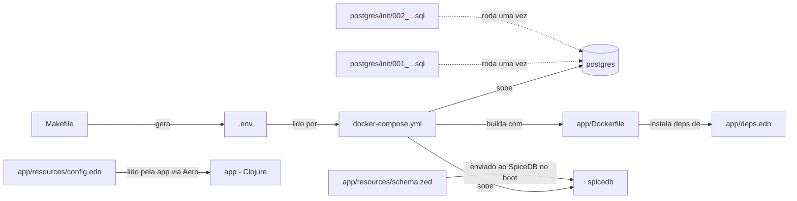

# Arquivos de configuração desta POC, explicados um por um

> Artigo 3 de 4. Este não é sobre SpiceDB nem ReBAC — é sobre a
> "engenharia de sustentação" do projeto: o que cada arquivo de
> configuração faz, por que existe, e o que quebraria se ele não
> existisse. Útil pra quem for abrir o projeto pela primeira vez e
> quiser saber "o que é esse arquivo aqui" sem precisar ler o código
> Clojure inteiro.

## Visão geral: quem lê o quê



---

## Raiz do projeto

### `docker-compose.yml`

Define os 4 serviços que compõem a POC (`postgres`, `spicedb-migrate`,
`spicedb`, `app`), a ordem de dependência entre eles
(`depends_on`/`condition`), as portas expostas pro seu host
(`localhost:5433`, `:50051`, `:3000`) e os dois volumes nomeados
(`poc_pg_data` — dados do Postgres; `m2-cache` — cache de dependências
Maven/Clojure, pra não rebaixar tudo a cada build). É o arquivo que
`make up`/`make db`/`make down`/`make reset` chamam por baixo — sem ele,
`docker compose` não sabe o que subir.

### `Makefile`

A camada de conveniência sobre o `docker-compose.yml` e sobre os
comandos `clojure -X:...` da aplicação. Cada alvo (`up`, `db`, `seed`,
`bench`, `mint-token`, `reset`, `logs`, `ps`) existe pra você não
precisar decorar a sintaxe exata de cada comando. O alvo `env` é o único
que faz algo além de encapsular — ele **gera** o `.env` (ver abaixo) na
primeira vez que qualquer outro alvo depende dele.

### `.env` (gerado, nunca commitado)

Não existe no repositório — é criado por `make env` (ou automaticamente
por `make up`/`make db`, que dependem dele) na primeira execução, com
duas variáveis:

```
SPICEDB_PRESHARED_KEY=<64 caracteres hex aleatórios>
JWT_HS256_SECRET=<64 caracteres hex aleatórios>
```

O `docker-compose.yml` lê essas duas variáveis automaticamente (o
Docker Compose sempre procura um arquivo `.env` na mesma pasta do
`docker-compose.yml`) e repassa pro container `spicedb` (como
`--grpc-preshared-key`) e pro container `app` (como env var
`JWT_HS256_SECRET`, usada pra assinar/validar os tokens). Cada
`make reset` + `make env` gera um par novo — por isso um token gerado
num ambiente nunca é válido em outro (ver o artigo sobre a collection do
Postman).

---

## `postgres/init/` — só rodam na primeira subida de cada volume

Esses dois scripts SQL rodam **automaticamente** pela imagem oficial do
Postgres (mecanismo `docker-entrypoint-initdb.d`), e **só na primeira
vez** que o volume `poc_pg_data` é criado do zero — rodar `make up` de
novo com o volume já existente não os executa de novo. Pra forçar,
precisa de `make reset` (que apaga o volume) antes.

### `001_create_databases.sql`

Cria as duas databases isoladas (`app`, `spicedb`) e os dois roles
(`app_user`, `spicedb_user`), cada um só com `CONNECT` na própria
database — o mecanismo de isolamento explicado nos outros artigos.

### `002_create_app_schema.sql`

Cria as tabelas `movies` e `users` **dentro da database `app`**
(por isso o `\connect app` na primeira linha) e concede privilégio nelas
pro `app_user`. É schema estático — não tem ferramenta de migration
(Flyway/Liquibase) nesta POC, porque são só duas tabelas descritivas que
não mudam com frequência (ver decisões arquiteturais na spec original).

---

## `app/` — a aplicação Clojure

### `deps.edn`

O equivalente Clojure de um `package.json`/`pom.xml`: declara as
dependências (Pedestal, cliente gRPC do SpiceDB, `component`, Aero,
`buddy-sign`, `next.jdbc`, `jsonista`) e os aliases executáveis
(`:run`, `:seed`, `:bench`, `:mint-token`) que o `Makefile` e o
`Dockerfile` invocam via `clojure -M:run` / `clojure -X:<alias>`.

### `Dockerfile`

Imagem baseada em `clojure:temurin-21-tools-deps-bookworm-slim`. Copia
só o `deps.edn` primeiro e roda `clojure -P` (baixa as dependências) antes
de copiar o resto do código — separar essas duas etapas é o que permite o
Docker reaproveitar a camada de dependências em rebuilds, desde que o
`deps.edn` não mude. O `docker-compose.yml` também monta `./app:/app`
como volume, então em desenvolvimento o container roda direto sobre o
código do seu disco, sem precisar rebuildar a cada mudança de `.clj`.

### `resources/config.edn`

Lido pela aplicação via Aero (`streaming-authz.config/load-config`) na
subida. Não tem valor nenhum hardcoded — cada chave usa `#env` pra puxar
de uma variável de ambiente (as mesmas que o `docker-compose.yml`
repassa pro container `app`: `PORT`, `SPICEDB_ENDPOINT`,
`SPICEDB_PRESHARED_KEY`, `APP_DB_JDBC_URL`, `JWT_HS256_SECRET`). É o
único lugar do código Clojure que sabe o *nome* das variáveis de
ambiente — o resto da aplicação só conhece o mapa de config já
resolvido.

### `resources/schema.zed`

O arquivo mais importante da POC, no sentido de que é ele quem define a
*regra* de autorização (ver os outros dois artigos pra entender o
conteúdo). Fica dentro de `resources/` porque é lido em tempo de
execução via `clojure.java.io/resource` (não é compilado, é lido como
texto e enviado ao SpiceDB via `WriteSchema` — ver `core.clj` e
`bootstrap.clj`) — mudar esse arquivo e reiniciar o container `app` já
aplica o schema novo, sem precisar tocar no Postgres.

> **Dica pra quem for editar o schema:** dá pra prototipar e testar um
> `.zed` novo **sem subir nada desta POC**, usando o
> [SpiceDB Playground](https://play.authzed.com/) da própria Authzed —
> um SpiceDB de verdade rodando via WebAssembly direto no navegador, sem
> instalar nada. Ele suporta escrever schema, relações de teste, e rodar
> checagens ao vivo enquanto você edita ("Check Watches"), além de
> declarar `Assertions` (afirmações positivas/negativas) e
> `Expected Relations` (lista exaustiva esperada) pra validar o schema —
> ver [Validation, Testing, Debugging SpiceDB Schemas](https://authzed.com/docs/spicedb/modeling/validation-testing-debugging).
> Bom pra rascunhar uma mudança de regra antes de trazer pra este
> `schema.zed` de verdade.

---

## O que fica de fora deste artigo (de propósito)

`CLAUDE.md`, `SECURITY_GUIDE.md`, `.gitignore` — são governança do
template/projeto, não configuração de execução da POC. Ver os arquivos
em si, e a Seção 5 do `CLAUDE.md`, para o contexto deles.

## Referências

- [SpiceDB Playground](https://play.authzed.com/) — ferramenta oficial da Authzed, sem necessidade de instalar nada.
- [Validation, Testing, Debugging SpiceDB Schemas — Authzed Docs](https://authzed.com/docs/spicedb/modeling/validation-testing-debugging) — os três mecanismos de teste de schema oferecidos pelo Playground/`zed`.
