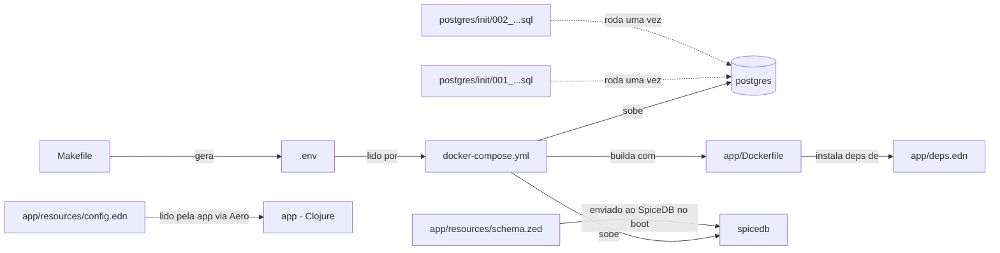

# Arquivos de configuração desta POC, um por um

> Artigo 3 de 5. Não é sobre SpiceDB nem ReBAC — é sobre "o que é esse
> arquivo aqui": o que cada arquivo de configuração do projeto faz, por
> que existe, e o que quebraria sem ele.

## Quem lê o quê



---

## Na raiz do projeto

### `docker-compose.yml`

Descreve os 4 serviços da POC (`postgres`, `spicedb-migrate`, `spicedb`,
`app`), em que ordem cada um precisa subir, quais portas ficam
disponíveis no seu computador (`localhost:5433`, `:50051`, `:3000`), e
dois "espaços de guardar dados" (`poc_pg_data` — os dados do Postgres;
`m2-cache` — as dependências do Clojure, pra não baixar tudo de novo a
cada build). É esse arquivo que `make up`/`make db`/`make down`/
`make reset` usam por baixo dos panos.

### `Makefile`

Um jeito mais fácil de rodar os comandos do `docker-compose.yml` e da
aplicação, sem precisar decorar a sintaxe certa de cada um. Cada alvo
(`up`, `db`, `seed`, `bench`, `mint-token`, `reset`, `logs`, `ps`) é um
atalho. O alvo `env` é o único que faz algo a mais além de atalho: ele
**cria** o `.env` (explicado abaixo) na primeira vez que você roda
qualquer comando que precise dele.

### `.env` (criado sozinho, nunca vai pro repositório)

Não existe no repositório — é criado pelo `make env` (ou
automaticamente por `make up`/`make db`) na primeira vez que você roda
a POC, com duas variáveis:

```
SPICEDB_PRESHARED_KEY=<64 caracteres aleatórios>
JWT_HS256_SECRET=<64 caracteres aleatórios>
```

O Docker Compose já procura esse arquivo sozinho e repassa essas
variáveis pro container do SpiceDB (como senha de acesso) e pro
container da app (pra assinar/conferir os tokens). Toda vez que você
roda `make reset` e depois `make env`, nasce um par novo — por isso um
token gerado numa máquina não funciona em outra (ver o artigo sobre a
collection do Postman).

---

## `postgres/init/` — só roda na primeira vez

Esses dois arquivos SQL rodam sozinhos, pela própria imagem do
Postgres, mas **só na primeira vez** que o "espaço de guardar dados"
(`poc_pg_data`) é criado do zero. Rodar `make up` de novo, com os dados
já lá, não executa esses scripts outra vez. Pra forçar de novo, precisa
de `make reset` antes (que apaga tudo).

### `001_create_databases.sql`

Cria as duas databases separadas (`app`, `spicedb`) e as duas
credenciais (`app_user`, `spicedb_user`), cada uma só conseguindo
entrar na própria database — o mecanismo de isolamento já explicado nos
outros artigos.

### `002_create_app_schema.sql`

Cria as tabelas `movies` e `users`, dentro da database `app`, e dá
permissão nelas pro `app_user`. São só duas tabelas simples que quase
não mudam, por isso não tem ferramenta de migration (tipo Flyway) nesta
POC — o SQL puro já resolve.

---

## `app/` — a aplicação Clojure

### `deps.edn`

A lista de dependências da aplicação (Pedestal, cliente do SpiceDB,
`component`, Aero, `buddy-sign`, `next.jdbc`, `jsonista`) e os comandos
prontos (`:run`, `:seed`, `:bench`, `:mint-token`) que o `Makefile` e o
`Dockerfile` chamam.

### `Dockerfile`

Monta a imagem da aplicação, começando de
`clojure:temurin-21-tools-deps-bookworm-slim`. Copia só o `deps.edn`
primeiro e baixa as dependências antes de copiar o resto do código —
assim, se você só mudar um arquivo `.clj`, o Docker não precisa baixar
tudo de novo. O `docker-compose.yml` também monta a pasta `./app`
direto dentro do container, então em desenvolvimento você edita o
código no seu computador e ele já reflete lá dentro, sem rebuild.

### `resources/config.edn`

O arquivo que a aplicação lê (via Aero) assim que sobe. Não tem nenhum
valor fixo escrito nele — cada linha usa `#env` pra buscar o valor de
uma variável de ambiente (as mesmas que o `docker-compose.yml` passa
pro container: `PORT`, `SPICEDB_ENDPOINT`, `SPICEDB_PRESHARED_KEY`,
`APP_DB_JDBC_URL`, `JWT_HS256_SECRET`). É o único lugar do código que
sabe o *nome* dessas variáveis — o resto da aplicação só recebe o mapa
já pronto.

### `resources/schema.zed`

O arquivo mais importante da POC — é ele que define a regra de "quem
pode ver o quê" (ver os artigos 1 e 2 pra entender o conteúdo). Fica em
`resources/` porque é lido como texto puro, na hora que a aplicação
sobe, e enviado pro SpiceDB (`WriteSchema`). Mudar esse arquivo e
reiniciar o container `app` já aplica a regra nova, sem mexer no
Postgres.

> **Dica pra quem for mexer no schema:** dá pra testar um `.zed` novo
> sem nem precisar subir esta POC, usando o
> [SpiceDB Playground](https://play.authzed.com/) — um SpiceDB de
> verdade rodando dentro do navegador, sem instalar nada. Ele deixa
> escrever schema, criar relações de teste, e ver o resultado mudando
> na hora que você edita ("Check Watches"), além de conferências
> automáticas chamadas `Assertions` e `Expected Relations` — ver
> [Validation, Testing, Debugging SpiceDB Schemas](https://authzed.com/docs/spicedb/modeling/validation-testing-debugging).
> Bom pra rascunhar uma ideia antes de trazer pra este `schema.zed` de
> verdade.

---

## O que este artigo não cobre (de propósito)

`CLAUDE.md`, `SECURITY_GUIDE.md`, `.gitignore` são regras do
template/projeto, não configuração de execução da POC. Ver esses
arquivos direto, e a Seção 5 do `CLAUDE.md`, se quiser esse contexto.

## Referências

- [SpiceDB Playground](https://play.authzed.com/) — ferramenta oficial da Authzed, sem instalação.
- [Validation, Testing, Debugging SpiceDB Schemas — Authzed Docs](https://authzed.com/docs/spicedb/modeling/validation-testing-debugging) — os três jeitos de testar um schema.
