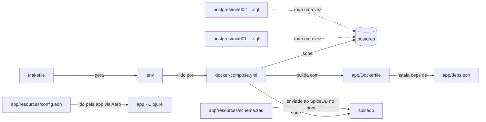

# Arquivos de configuração desta POC

> Artigo 3 de 4. Descreve os arquivos de configuração e infraestrutura
> do projeto — função, motivação e dependências entre eles —, não os
> conceitos de SpiceDB tratados nos artigos 1 e 2.

## Dependências entre arquivos



---

## Raiz do projeto

### `docker-compose.yml`

Define os quatro serviços da POC (`postgres`, `spicedb-migrate`,
`spicedb`, `app`), a ordem de dependência entre eles
(`depends_on`/`condition`), as portas expostas ao host (`localhost:5433`,
`:50051`, `:3000`) e dois volumes nomeados (`poc_pg_data` para dados do
Postgres; `m2-cache` para cache de dependências Maven/Clojure). É o
arquivo invocado por `make up`/`make db`/`make down`/`make reset`.

### `Makefile`

Camada de encapsulamento sobre `docker-compose.yml` e sobre os comandos
`clojure -X:...` da aplicação. Cada alvo (`up`, `db`, `seed`, `bench`,
`mint-token`, `reset`, `logs`, `ps`) evita a necessidade de memorizar a
sintaxe subjacente de cada comando. O alvo `env` é o único com efeito
além de encapsulamento: gera o `.env` (descrito a seguir) na primeira
execução de qualquer alvo que dele dependa.

### `.env` (gerado, não versionado)

Ausente do repositório; criado por `make env` (ou implicitamente por
`make up`/`make db`) na primeira execução, com duas variáveis:

```
SPICEDB_PRESHARED_KEY=<64 caracteres hex aleatórios>
JWT_HS256_SECRET=<64 caracteres hex aleatórios>
```

O Docker Compose lê automaticamente um arquivo `.env` presente no mesmo
diretório de `docker-compose.yml`, repassando essas variáveis ao
container `spicedb` (`--grpc-preshared-key`) e ao container `app`
(`JWT_HS256_SECRET`, usada para assinatura e validação de tokens). Cada
execução de `make reset` seguida de `make env` gera um par novo — um
token emitido em um ambiente não é válido em outro (ver a collection do
Postman).

---

## `postgres/init/` — execução única por volume

Os dois scripts SQL são executados automaticamente pela imagem oficial
do Postgres (mecanismo `docker-entrypoint-initdb.d`), exclusivamente na
criação inicial do volume `poc_pg_data`; reexecuções de `make up` sobre
um volume já existente não os invocam novamente. Repetição requer
`make reset` (remoção do volume) previamente.

### `001_create_databases.sql`

Cria as databases isoladas `app` e `spicedb`, e os roles `app_user` e
`spicedb_user`, cada um com privilégio `CONNECT` restrito à própria
database — mecanismo de isolamento detalhado nos demais artigos.

### `002_create_app_schema.sql`

Cria as tabelas `movies` e `users` na database `app` (daí o `\connect
app` na primeira linha) e concede privilégio sobre elas a `app_user`.
O schema é estático — sem ferramenta de migration (Flyway/Liquibase)
nesta POC, dado tratar-se de duas tabelas descritivas de baixa
frequência de alteração.

---

## `app/` — aplicação Clojure

### `deps.edn`

Equivalente funcional de `package.json`/`pom.xml`: declara as
dependências (Pedestal, cliente gRPC do SpiceDB, `component`, Aero,
`buddy-sign`, `next.jdbc`, `jsonista`) e os aliases executáveis
(`:run`, `:seed`, `:bench`, `:mint-token`) invocados pelo `Makefile` e
pelo `Dockerfile` via `clojure -M:run` / `clojure -X:<alias>`.

### `Dockerfile`

Imagem baseada em `clojure:temurin-21-tools-deps-bookworm-slim`. O
`deps.edn` é copiado e resolvido (`clojure -P`) antes da cópia do
restante do código-fonte — separação que permite ao Docker reaproveitar
a camada de dependências em rebuilds subsequentes, desde que `deps.edn`
permaneça inalterado. O `docker-compose.yml` monta `./app:/app` como
volume, de modo que o container opera diretamente sobre o código-fonte
do disco, sem exigir rebuild a cada alteração de arquivo `.clj`.

### `resources/config.edn`

Carregado pela aplicação via Aero (`streaming-authz.config/load-config`)
na inicialização. Não contém valor fixo: cada chave utiliza `#env` para
resolução a partir de variável de ambiente (as mesmas repassadas pelo
`docker-compose.yml` ao container `app`: `PORT`, `SPICEDB_ENDPOINT`,
`SPICEDB_PRESHARED_KEY`, `APP_DB_JDBC_URL`, `JWT_HS256_SECRET`). É o
único ponto do código Clojure com conhecimento do nome dessas variáveis;
o restante da aplicação recebe o mapa de configuração já resolvido.

### `resources/schema.zed`

Arquivo de maior relevância na POC, por definir a regra de autorização
(conteúdo detalhado nos artigos 1 e 2). Reside em `resources/` por ser
lido em tempo de execução via `clojure.java.io/resource` — não é
compilado; é lido como texto e transmitido ao SpiceDB via `WriteSchema`
(`core.clj`, `bootstrap.clj`). Alteração deste arquivo seguida de
reinício do container `app` aplica o novo schema sem intervenção no
Postgres.

**Observação sobre validação de schema:** é possível prototipar e
validar um `.zed` sem executar esta POC, utilizando o
[SpiceDB Playground](https://play.authzed.com/) da Authzed — uma
instância de SpiceDB executada via WebAssembly no navegador, sem
instalação local. A ferramenta suporta edição de schema, definição de
relações de teste, verificação de permissões em tempo real durante a
edição ("Check Watches"), além de `Assertions` (afirmações positivas e
negativas) e `Expected Relations` (enumeração exaustiva esperada) para
validação do schema — ver
[Validation, Testing, Debugging SpiceDB Schemas](https://authzed.com/docs/spicedb/modeling/validation-testing-debugging).

---

## Fora do escopo deste artigo

`CLAUDE.md`, `SECURITY_GUIDE.md` e `.gitignore` constituem governança do
projeto/template, não configuração de execução da POC — ver esses
arquivos e a Seção 5 de `CLAUDE.md`.

## Referências

- [SpiceDB Playground](https://play.authzed.com/) — ferramenta oficial da Authzed.
- [Validation, Testing, Debugging SpiceDB Schemas — Authzed Docs](https://authzed.com/docs/spicedb/modeling/validation-testing-debugging) — mecanismos de teste de schema oferecidos pelo Playground/`zed`.
