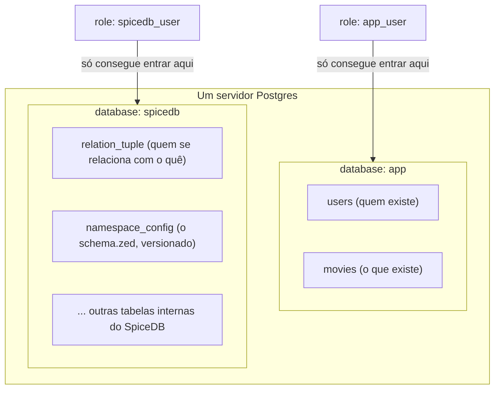
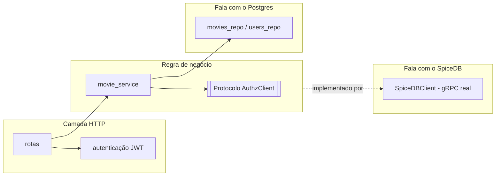
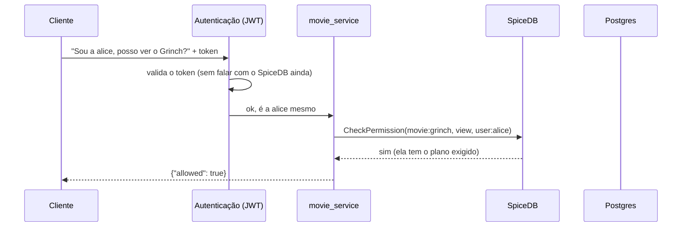

# Como o SpiceDB funciona nesta POC

> Artigo 2 de 2. O primeiro (`o-que-e-spicedb-rebac-abac.md`) explica os
> conceitos gerais — ReBAC, ABAC, Zanzibar, o caso da Netflix. Este aqui
> é o "olha o motor por dentro": explica exatamente o que acontece nesta
> POC específica, arquivo por arquivo, tabela por tabela.

## O problema que esta POC tenta resolver

Imagine um serviço de streaming. Ele já tem um banco de dados com usuários e
filmes — isso nunca foi problema. O problema é outra pergunta, que parece
simples mas não é: **"este usuário específico pode assistir a este filme
específico, agora?"**

Hoje, a resposta a essa pergunta normalmente mora espalhada pelo código:
um `if` aqui checando o plano do usuário, outro ali checando se ele
comprou aquele filme avulso, outro checando se é um filme liberado por
uma promoção sazonal, outro ainda para o caso especial de alguém que
ganhou acesso de cortesia. Cada regra nova de acesso vira mais um `if`
espalhado, e ninguém consegue responder com confiança "quem, hoje, pode
ver o quê" sem ler (e entender) todo esse código.

Essa POC existe para testar uma resposta diferente: **e se "quem pode
acessar o quê" não fosse uma pergunta que o código respondesse
calculando na hora, e sim uma pergunta que um banco de dados
especializado em relações já soubesse responder, porque essas relações
estão todas escritas nele, de um jeito só?**

Esse banco especializado é o SpiceDB. A pergunta que a POC precisa
responder não é "SpiceDB funciona tecnicamente" (isso qualquer
documentação garante) — é: **esse jeito de modelar autorização como um
grafo de relações é mais claro, mais seguro e mais fácil de evoluir do
que a alternativa de espalhar `if`s pelo código?** O resto deste artigo
mostra como a POC foi montada para responder isso.

---

## O "elenco de personagens" desta POC

Antes do código, vale nomear as peças, porque elas se repetem em toda
explicação daqui pra frente:

- **`user`** — uma pessoa (`alice`, `bob`).
- **`plan`** — um plano de assinatura (`basic`, `medium`, `premium`),
  organizados em ordem crescente de acesso.
- **`commercial_product`** — algo que se compra avulso, fora do plano
  (ex.: uma promoção de Natal).
- **`content_tag`** — uma etiqueta de conteúdo (ex.: "filmes natalinos"),
  que pode ser liberada por mais de um caminho.
- **`movie`** — o recurso final que alguém quer acessar. Tem uma
  permissão (`view`) e quatro jeitos de chegar a ela — por plano, por
  tag, por concessão direta, ou (o quarto, mais novo) por **caveat**
  (ver a seção dedicada mais abaixo).

E duas tabelas "normais" de banco relacional, que não têm nada de
especial — são só metadados descritivos:

- **`movies`** (`id`, `title`, `synopsis`, `genre`, `release_year`,
  `duration_minutes`) — o catálogo: o que existe e como se descreve,
  não quem pode ver.
- **`users`** (`id`, `email`, `display_name`, `country`, `created_at`)
  — quem existe e como se descreve. Repare: `country` aqui é só um
  **dado de perfil** (o país que o usuário informou/tem cadastrado) —
  não é usado automaticamente por nenhuma checagem de autorização. O
  exemplo de Caveat mais abaixo usa uma região enviada explicitamente
  na requisição, não esse campo — a diferença importa, e é explicada
  lá.

O pulo do gato: **nem `movies` nem `users` guardam quem pode acessar o
quê.** Essa informação — o coração da autorização — não é uma coluna
numa tabela relacional. Ela é um grafo de relações, e vive inteiramente
dentro do SpiceDB.

---

## Onde cada dado mora — e por que separado

A POC roda com **um único servidor Postgres**, mas com **duas databases
isoladas dentro dele**, cada uma com seu próprio usuário/senha, sem
permissão de acessar a database da outra:



Por que separar assim, em vez de um Postgres só com tudo junto?

1. **O SpiceDB é dono das próprias tabelas.** As tabelas dentro da
   database `spicedb` — vimos nomes reais como `relation_tuple`,
   `namespace_config`, `caveat`, `relation_tuple_transaction` rodando
   durante a migration desta POC (estrutura e exemplos de linha reais em
   `.docs/como-o-spicedb-guarda-dados-no-postgres.md`) — são geridas
   inteiramente pelo binário
   do SpiceDB (`spicedb migrate head`). Ninguém no nosso código Clojure
   faz `SELECT` nelas. É "propriedade privada" do SpiceDB, e mexer nelas
   por fora seria como editar o arquivo de um banco de dados enquanto
   ele está aberto — arriscado e sem necessidade, porque existe uma API
   (gRPC) feita exatamente para isso.
2. **Vazamento de credencial não vira vazamento de autorização.** Se
   algum dia a credencial da aplicação (`app_user`) vazar, quem a pegar
   consegue ler `movies`/`users` — chato, mas não consegue nem tentar
   ler ou escrever o grafo de permissões, porque `app_user` não tem
   `CONNECT` na database `spicedb`. É o princípio de menor privilégio
   aplicado literalmente na fronteira do banco.
3. **É o cenário real que a POC precisa provar.** Numa empresa que já
   tem um Postgres de produção com dados de negócio, a pergunta prática
   é "dá pra colocar o SpiceDB do lado, sem misturar com o que já
   existe?" — e a resposta que esta POC valida é: sim, na mesma
   instância, numa database separada.

---

## O schema: onde a regra de negócio vira grafo

O arquivo `app/resources/schema.zed` é o único lugar onde a *regra* de
quem pode ver o quê é declarada — não em código Clojure, em uma
linguagem declarativa própria do SpiceDB:

```zed
definition movie {
    relation required_plan: plan
    relation tag: content_tag
    relation direct_viewer: user
    relation region_locked_viewer: user with region_allowed
    permission view = (required_plan->is_member) + (tag->has_access) + direct_viewer + region_locked_viewer
}
```

Ler essa última linha em português: "alguém pode `view` (ver) um filme
se: (a) ele é membro do plano exigido pelo filme, OU (b) ele tem acesso
à tag do filme (por outro caminho, tipo produto avulso), OU (c) ele foi
liberado diretamente para aquele filme, OU (d) ele passa na condição de
região (explicada na próxima seção)." Quatro caminhos, um só resultado.
Isso é o que se chama de **múltiplos caminhos para a mesma permissão** —
um dos padrões centrais do ReBAC (ver o outro artigo para a teoria).

Importante, porque foi um bug real que apareceu durante a implementação:
a **direção** da relação `inherits` entre planos importa. A intenção é
"quem tem o plano superior automaticamente satisfaz os planos
inferiores" — e isso só funciona se o plano *inferior* apontar `inherits`
para o *superior* (`plan:basic --inherits--> plan:medium`), não o
contrário. Modelar autorização como grafo não elimina a possibilidade de
erro — troca "erro escondido num `if`" por "erro visível e testável
numa tupla de relação", o que já é uma vitória, mas exige entender a
direção da seta.

---

## Caveats na prática: o mesmo dado, duas respostas diferentes

O artigo geral (`o-que-e-spicedb-rebac-abac.md`) explica Caveats na
teoria — a feature que a própria Netflix patrocionou pra ter ABAC dentro
do SpiceDB. Aqui está o exemplo rodando de verdade nesta POC, não só
citado.

Primeiro, uma condição, declarada no schema:

```zed
caveat region_allowed(user_region string, allowed_regions list<string>) {
    user_region in allowed_regions
}
```

Ela recebe dois valores: `allowed_regions` é gravado **junto com a
relação**, no momento em que ela é escrita (é um dado estático, como
qualquer outra tupla). `user_region` **não é gravado em lugar nenhum**
— ele só existe no instante da pergunta, como parâmetro da própria
chamada de `CheckPermission`. É essa diferença de "quando o dado chega"
que separa ABAC de ReBAC.

Na seed, o filme `filme_regional` recebe essa relação para a `alice`,
liberado só para Brasil e Argentina:

```clojure
{:resource-type "movie" :resource-id "filme_regional" :relation "region_locked_viewer"
 :subject-type "user" :subject-id "alice"
 :caveat {:name "region_allowed" :context {:allowed_regions ["BR" "AR"]}}}
```

E a rota HTTP repassa a região da requisição (`?region=`) como o
atributo vivo, no momento da checagem — não lê isso de nenhuma coluna
do Postgres, é passado explicitamente a cada chamada, simulando o que
num sistema real viria de geolocalização por IP:

```clojure
(let [region (get-in request [:query-params :region])
      context (when region {:user_region region})]
  (movie-service/can-view? system {:user-id user-id :movie-id movie-id} context))
```

Resultado testado ao vivo, mesma relação gravada uma única vez:

```bash
curl "http://localhost:3000/movies/filme_regional/access" \
  -H "Authorization: Bearer $ALICE_JWT"                       # {"allowed":false} — sem região, fail-closed
curl "http://localhost:3000/movies/filme_regional/access?region=BR" \
  -H "Authorization: Bearer $ALICE_JWT"                       # {"allowed":true}
curl "http://localhost:3000/movies/filme_regional/access?region=US" \
  -H "Authorization: Bearer $ALICE_JWT"                       # {"allowed":false}
```

Note o "sem região, fail-closed": quando o contexto necessário pro
caveat não chega, o SpiceDB não consegue provar que a condição é
verdadeira — e por padrão, se `check-permission` não recebe uma resposta
definitivamente positiva (`PERMISSIONSHIP_HAS_PERMISSION`), ela retorna
`false`. Isso vale tanto para "negado" quanto para "não deu pra saber"
— o mesmo princípio de segurança já usado no resto da POC (negar por
padrão, nunca assumir acesso).

Também dá pra escrever uma relação com caveat em runtime, pela mesma
rota que já existia:

```bash
curl -X POST http://localhost:3000/relationships \
  -H "Authorization: Bearer $ALICE_JWT" -H "Content-Type: application/json" \
  -d '{"resource-type":"movie","resource-id":"filme_regional","relation":"region_locked_viewer",
       "subject-type":"user","subject-id":"bob",
       "caveat":{"name":"region_allowed","context":{"allowed_regions":["PT"]}}}'
```

---

## As peças de código, e o papel de cada uma



- **`domain/authz_client.clj`** — não tem nenhuma linha de código que
  fale gRPC. É só uma "promessa de contrato": quatro funções que
  qualquer implementação de autorização precisa saber fazer
  (`check-permission`, `lookup-resources`, `write-relationships!`,
  `write-schema!`). Por quê isso importa? Porque a regra de negócio
  (`movie_service`) nunca precisa saber que existe gRPC, Protobuf ou
  SpiceDB — ela só conhece esse contrato. Se um dia a empresa decidir
  trocar de motor de autorização, essa é a única parede que muda.
- **`infra/spicedb/client.clj`** — a implementação de verdade desse
  contrato, falando o protocolo gRPC do SpiceDB. É aqui que "ver se
  alice pode assistir ao Grinch" vira, de fato, uma chamada de rede para
  o processo do SpiceDB.
- **`domain/movie_service.clj`** — a regra de negócio propriamente dita.
  Duas funções: `can-view?` (pergunta simples, sim/não) e
  `available-movies` (pergunta mais interessante: "me dê a lista de tudo
  que este usuário pode ver" — o SpiceDB responde com uma lista de ids,
  e o Postgres entra depois só para buscar título/sinopse desses ids).
- **`infra/http/*`** — a camada HTTP (Pedestal) e o interceptor de
  autenticação. Importante: **autenticação (quem é você) e autorização
  (o que você pode fazer) são coisas propositalmente separadas aqui.**
  Um JWT inválido nunca chega a consultar o SpiceDB — é rejeitado antes,
  com `401`. Só depois de saber *quem* pergunta é que se pergunta *o
  quê* essa pessoa pode fazer.

## O fluxo completo de uma pergunta de autorização



Note o que **não** acontece nesse fluxo: em nenhum momento o código
Clojure percorre a árvore de planos, verifica heranças ou soma
condições manualmente. Ele faz uma pergunta e recebe uma resposta. Toda
a complexidade da regra "por quê" vive dentro do schema, não no código
que pergunta.

## Como rodar, na prática

```bash
make up                    # sobe tudo (gera .env com secrets de dev automaticamente)
make mint-token            # gera um token de teste pra alice
make mint-token USER_ID=bob

curl http://localhost:3000/movies/grinch/access -H "Authorization: Bearer <token>"
curl http://localhost:3000/available-movies -H "Authorization: Bearer <token>"

curl "http://localhost:3000/movies/filme_regional/access?region=BR" -H "Authorization: Bearer <token>"  # Caveat: true
curl "http://localhost:3000/movies/filme_regional/access?region=US" -H "Authorization: Bearer <token>"  # Caveat: false

make seed PROFILE=medium   # popula com volume (200 usuários, 80 filmes)
make bench PROFILE=medium  # mede latência das checagens de permissão

make reset                 # zera tudo (Postgres do zero)
```

Ver o `README.md` na raiz do repositório para a lista completa de
comandos e cenários de teste.

## O veredito que esta POC ajuda a dar

No fim, a pergunta de negócio não é "o SpiceDB funciona" — é "vale a pena
trocar o jeito atual de fazer autorização por este". Os sinais que esta
POC dá para essa decisão:

- **A favor:** a regra de acesso fica num lugar só (o `schema.zed`), em
  vez de espalhada; mudar uma relação (ex.: dar acesso avulso a um
  filme) é uma chamada de API, não um deploy; a separação
  autenticação/autorização fica explícita na arquitetura, não só na
  cabeça de quem escreveu o código; e — testado ao vivo nesta POC, não
  só documentado — dá pra evoluir de ReBAC puro para ABAC-dentro-do-ReBAC
  (Caveats) sem trocar de motor nem reescrever o que já existe, quando o
  problema real precisar de atributos avaliados na hora (região,
  dispositivo, fraude).
- **Custo a considerar:** existe uma peça nova rodando (o próprio
  SpiceDB), uma linguagem nova para aprender (`zed`), e — como o bug da
  direção do `inherits` (e, depois, o bug do `route/query-params` sendo
  chamado como função) mostraram — a modelagem em grafo e a integração
  gRPC têm seus próprios jeitos de errar, só que mais visíveis e
  testáveis do que um `if` perdido.
